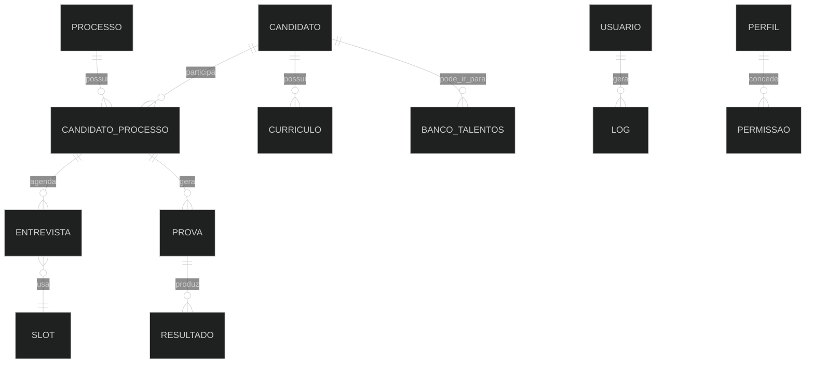

# Arquitetura funcional

Esta arquitetura descreve o produto, nao a tecnologia interna.

## Camadas funcionais

| Camada          | Descricao                         | Exemplos                                        |
| --------------- | --------------------------------- | ----------------------------------------------- |
| Acesso          | Controla entrada e permissao      | Login, sessao, acesso negado, perfil do usuario |
| Operacao diaria | Apoia rotina de RH                | Inicio, e-mails, entrevistas, processos         |
| Recrutamento    | Conduz vaga e candidato           | Processo, ficha, status, aprovacao, eliminacao  |
| Avaliacao       | Mede aderencia e resultado        | Analise de CV, prova, nota, alertas             |
| Relacionamento  | Mantem contato e reaproveitamento | WhatsApp, e-mail, banco de talentos             |
| Governanca      | Controla regras e auditoria       | Usuarios, perfis, permissoes, logs, catalogos   |

## Objetos centrais

## Dependencias funcionais

| Origem                | Depende de                               | Resultado                                   |
| --------------------- | ---------------------------------------- | ------------------------------------------- |
| Processo              | vaga, operacao, trilha, quantidade, data | Lista e detalhes de processo                |
| Candidato no processo | candidato + processo aberto              | Pipeline, entrevista, prova, decisao        |
| Agendamento           | candidato elegivel + slot disponivel     | Entrevista e status associado               |
| Prova gerada          | candidato/prova configurada              | Link/codigo de acesso e posterior resultado |
| Aprovacao             | candidato em status permitido            | Status final e comunicacao                  |
| Eliminacao            | motivo e etapa                           | Status final e historico                    |
| Banco de talentos     | candidato existente                      | Reaproveitamento futuro                     |
| Configuracoes         | permissao administrativa                 | Alteracao de regras, usuarios e catalogos   |
