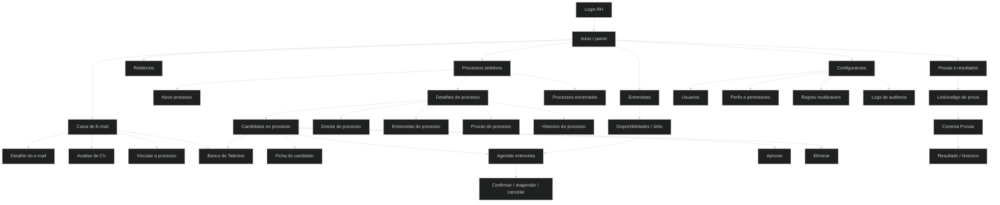

# Mapa macro do Conecta

## Visao geral

## Areas principais

| Area | Papel no produto | Entrada principal | Saidas |
| --- | --- | --- | --- |
| Inicio | Painel operacional e atalhos | Login | E-mails, processos, entrevistas, relatorios, configuracoes |
| E-mails | Triagem de curriculos recebidos | Menu ou painel | Analise de CV, vinculo, banco de talentos |
| Processos | Criacao e gestao de vagas | Menu Processos | Detalhes, candidatos, entrevistas, provas, encerramento |
| Candidatos | Visao consolidada da pessoa candidata | Relatorios > Candidatos | Ficha, edicao, status, processo, banco |
| Entrevistas | Calendario e slots | Menu Entrevistas | Disponibilidade e agenda |
| Banco de Talentos | Reaproveitamento | Menu ou acoes de candidato/e-mail | Uso em processo, edicao, eliminacao |
| Provas e Resultados | Gestao de provas geradas | Menu Processos | Detalhes, alertas, cancelamento/reabertura |
| Configuracoes | Governanca | Menu Configuracoes | Usuarios, perfis, catalogos, logs |
| Conecta Provas | Entrada externa do candidato | Link/codigo | Prova realizada e resultado |

## Pontos de entrada

- Login interno do RH.
- Menu lateral.
- Atalhos da pagina inicial.
- Busca global.
- Link publico de prova `#/conecta-provas`.
- Link publico de candidatura `#/candidatar/<slug>`, identificado mas sem link ativo na amostra.

## Pontos de saida

- Logout.
- Exportacao de logs.
- Downloads de prova/CV/anexos quando disponiveis.
- Links externos/compartilhamento de vaga e prova.
