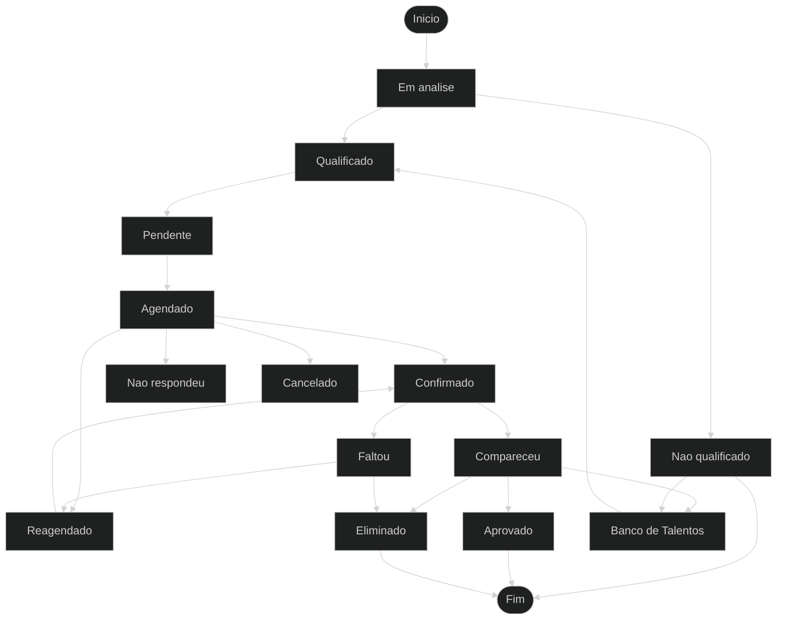
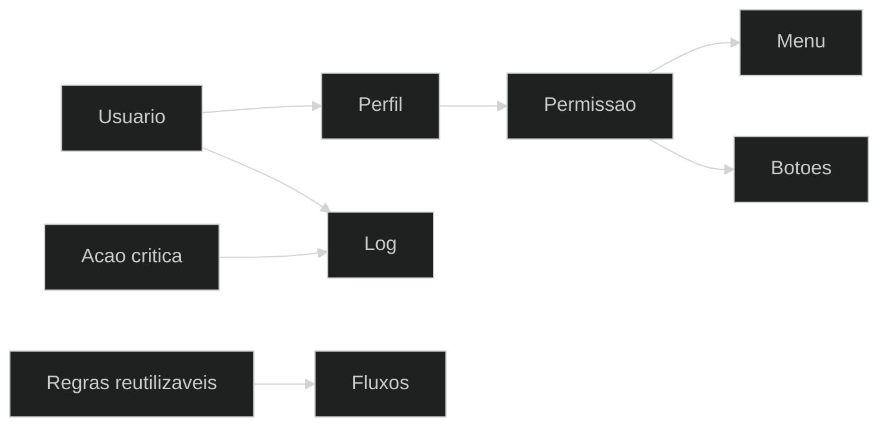

# Diagramas

## Transicao simplificada de candidato

```mermaid
%%{init: {"theme": "dark"}}%%
flowchart TD
  Inicio([Inicio]) --> EmAnalise["Em analise"]
  EmAnalise --> Qualificado["Qualificado"]
  EmAnalise --> NaoQualificado["Nao qualificado"]
  Qualificado --> Pendente["Pendente"]
  Pendente --> Agendado["Agendado"]
  Agendado --> Confirmado["Confirmado"]
  Agendado --> Reagendado["Reagendado"]
  Agendado --> NaoRespondeu["Nao respondeu"]
  Agendado --> Cancelado["Cancelado"]
  Confirmado --> Compareceu["Compareceu"]
  Confirmado --> Faltou["Faltou"]
  Reagendado --> Confirmado
  Compareceu --> Aprovado["Aprovado"]
  Compareceu --> Eliminado["Eliminado"]
  Compareceu --> BancoDeTalentos["Banco de Talentos"]
  Faltou --> Reagendado
  Faltou --> Eliminado
  NaoQualificado --> BancoDeTalentos
  NaoQualificado --> Fim([Fim])
  Aprovado --> Fim
  Eliminado --> Fim
  BancoDeTalentos --> Qualificado
```

## Governanca

```mermaid
%%{init: {"theme": "dark"}}%%
flowchart LR
  Usuario --> Perfil
  Perfil --> Permissao
  Permissao --> Menu
  Permissao --> Botoes
  Usuario --> Log
  Acao["Acao critica"] --> Log
  Catalogo["Regras reutilizaveis"] --> Fluxos
```
