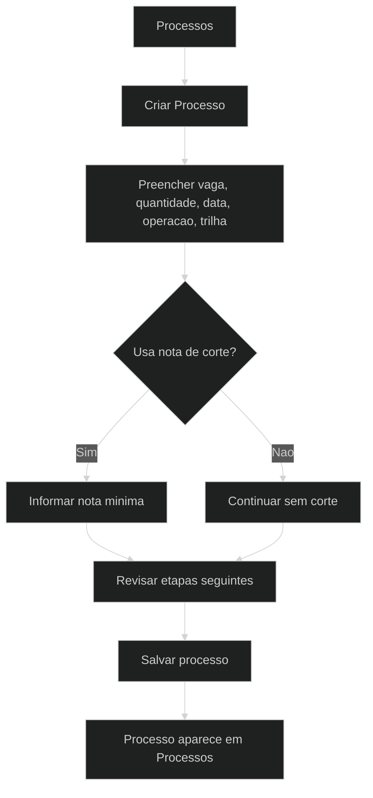
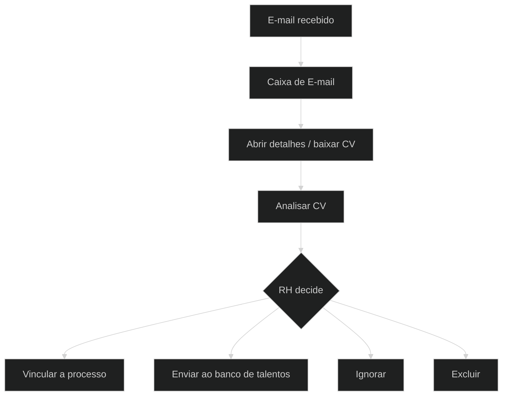
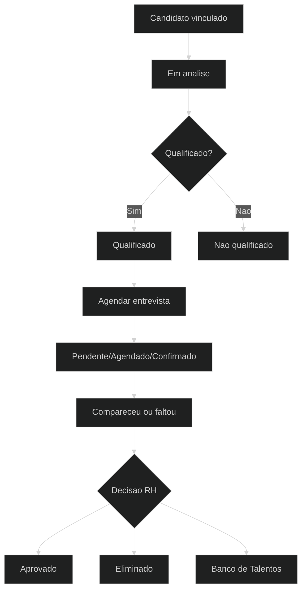
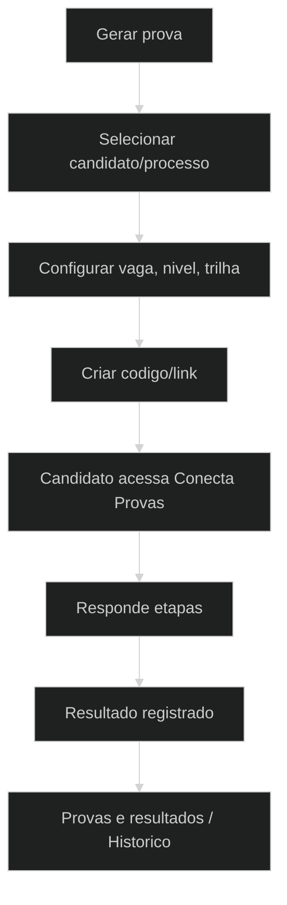

# Fluxos principais

## Criacao de processo

```mermaid
%%{init: {"theme": "dark"}}%%
flowchart TD
  A["Processos"] --> B["Criar Processo"]
  B --> C["Preencher vaga, quantidade, data, operacao, trilha"]
  C --> D{"Usa nota de corte?"}
  D -- Sim --> E["Informar nota minima"]
  D -- Nao --> F["Continuar sem corte"]
  E --> G["Revisar etapas seguintes"]
  F --> G
  G --> H["Salvar processo"]
  H --> I["Processo aparece em Processos"]
```

## Entrada pela caixa de e-mail

```mermaid
%%{init: {"theme": "dark"}}%%
flowchart TD
  A["E-mail recebido"] --> B["Caixa de E-mail"]
  B --> C["Abrir detalhes / baixar CV"]
  C --> D["Analisar CV"]
  D --> E{"RH decide"}
  E --> F["Vincular a processo"]
  E --> G["Enviar ao banco de talentos"]
  E --> H["Ignorar"]
  E --> I["Excluir"]
```

## Candidato no processo

```mermaid
%%{init: {"theme": "dark"}}%%
flowchart TD
  A["Candidato vinculado"] --> B["Em analise"]
  B --> C{"Qualificado?"}
  C -- Sim --> D["Qualificado"]
  C -- Nao --> E["Nao qualificado"]
  D --> F["Agendar entrevista"]
  F --> G["Pendente/Agendado/Confirmado"]
  G --> H["Compareceu ou faltou"]
  H --> I{"Decisao RH"}
  I --> J["Aprovado"]
  I --> K["Eliminado"]
  I --> L["Banco de Talentos"]
```

## Prova

```mermaid
%%{init: {"theme": "dark"}}%%
flowchart TD
  A["Gerar prova"] --> B["Selecionar candidato/processo"]
  B --> C["Configurar vaga, nivel, trilha"]
  C --> D["Criar codigo/link"]
  D --> E["Candidato acessa Conecta Provas"]
  E --> F["Responde etapas"]
  F --> G["Resultado registrado"]
  G --> H["Provas e resultados / Historico"]
```
