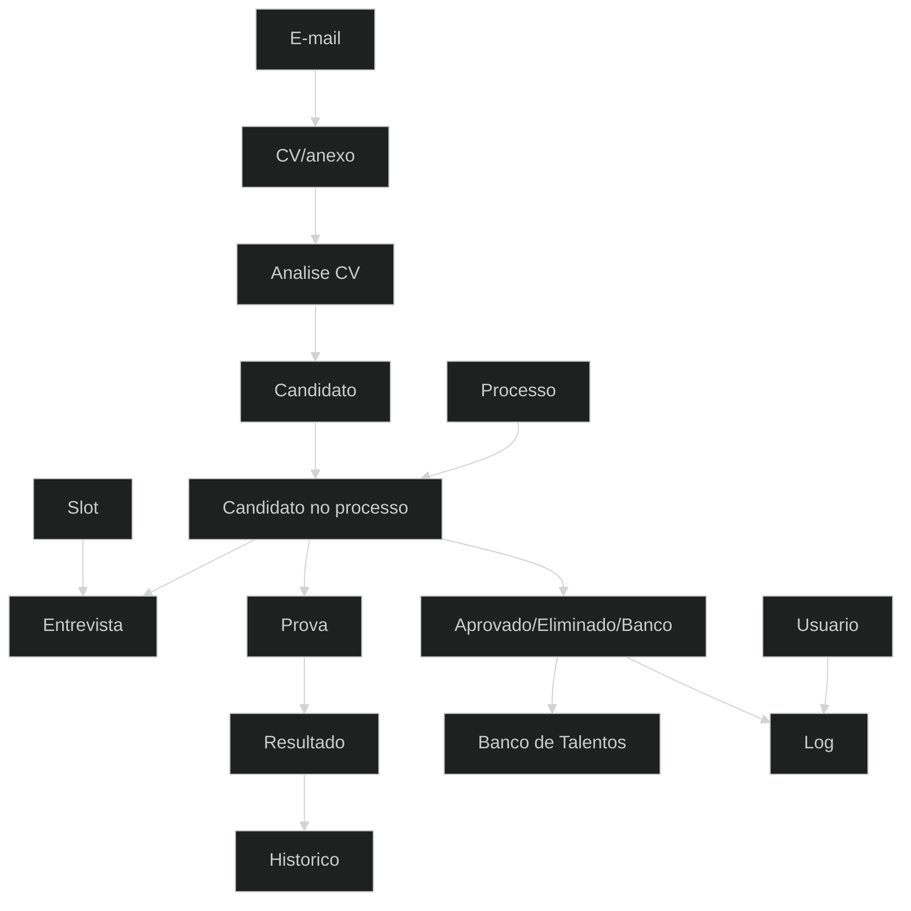

# Relacionamento dos dados

## Pontos de sincronizacao

- Alterar contato do candidato deve refletir em ficha, processo, banco e comunicacao.
- Alterar status do candidato afeta listas, filtros, acoes permitidas e relatorios.
- Encerrar processo deve bloquear acoes em detalhes, entrevistas e prova vinculada.
- Alterar perfil/permissao afeta menu e botoes no proximo carregamento/sessao.
