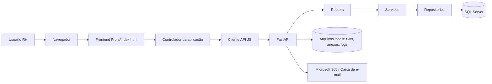

# 02 — Arquitetura

## Visão em camadas

## Frontend

O frontend fica em `Front/` e usa navegação por hash, por exemplo `#/login`, `#/inicio`, `#/processos`.

Fluxo simplificado:

1. `Front/index.html` carrega bibliotecas e `fonte/principal.js`.
2. `principal.js` inicializa a aplicação.
3. `app/aplicacao-raiz.js` decide qual tela renderizar.
4. `app/controlador-aplicacao.js` guarda o estado central, navegação e ações de alto nível.
5. `features/*` renderiza telas específicas.
6. `services/api/*` chama endpoints do backend.

## Backend

O backend fica em `api/`.

Fluxo simplificado:

1. `api/app.py` expõe `app` para o Uvicorn.
2. `rh_api/main.py` cria a aplicação FastAPI, CORS, handlers de erro e registra routers.
3. `routers/*` recebem HTTP e validam entrada.
4. `schemas/*` definem contratos Pydantic.
5. `services/*` normalizam dados e aplicam regras auxiliares.
6. `repositories/*` concentram SQL, persistência e consultas.
7. `db.py` cria a conexão com SQL Server.

## Persistência

A API usa SQL Server via `pyodbc`. No startup, `bootstrap_runtime_schema(settings)` tenta criar/complementar tabelas e colunas necessárias. Isso é útil para evoluir o banco sem depender de scripts manuais em toda alteração.

## Integração com e-mail

A caixa de currículos é configurável por variáveis de ambiente ou `config.ini`. O código prevê:

- Microsoft 365;
- IMAP;
- OAuth2;
- segredo do client secret em variável de ambiente, não no arquivo;
- pasta local para anexos baixados.

## Observação de segurança

O `.env` real do projeto não deve ser versionado nem documentado com valores sensíveis. A documentação deve manter apenas nomes de variáveis, exemplos e instruções seguras.
