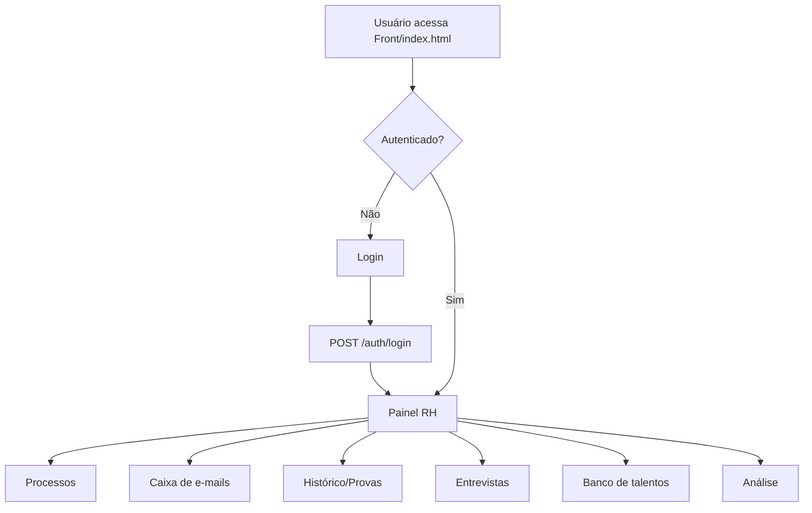
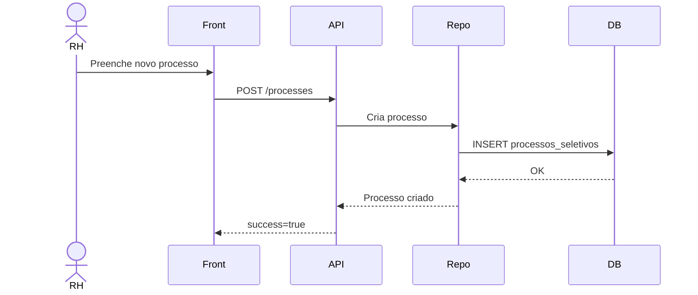
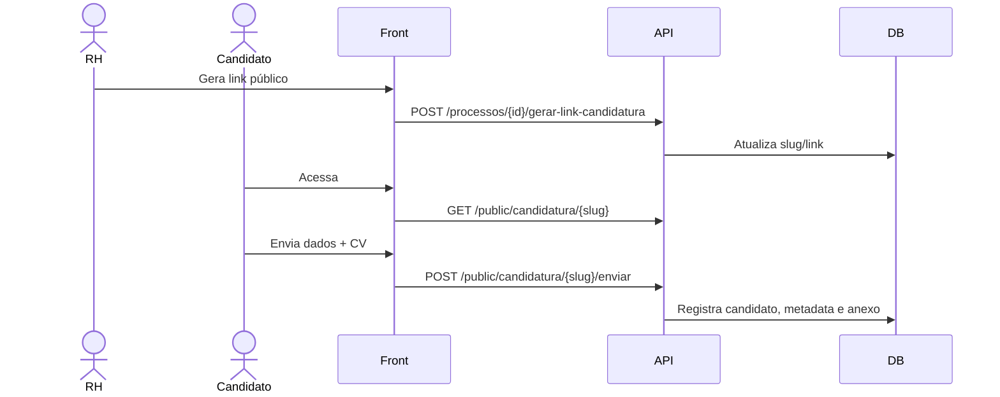
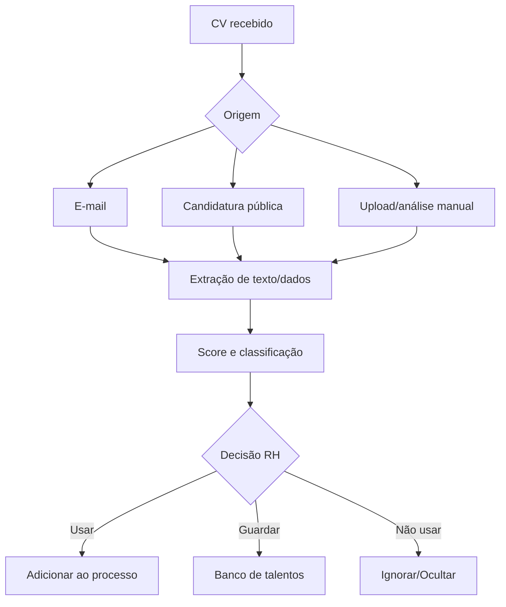
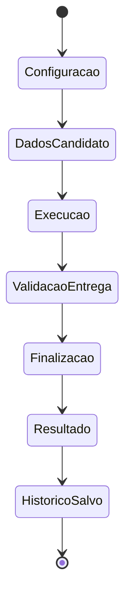
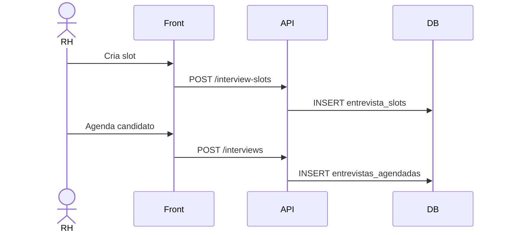
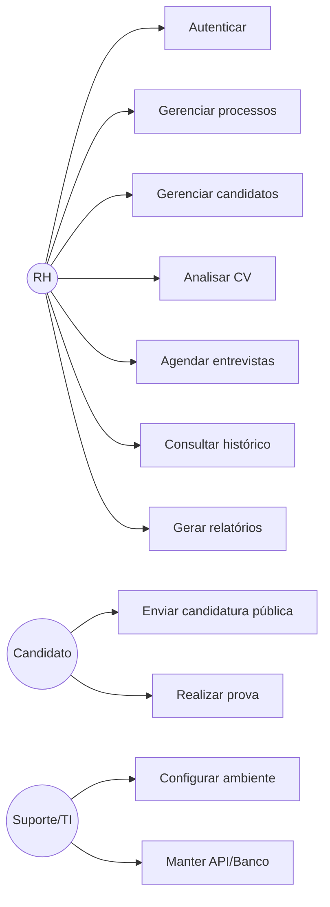
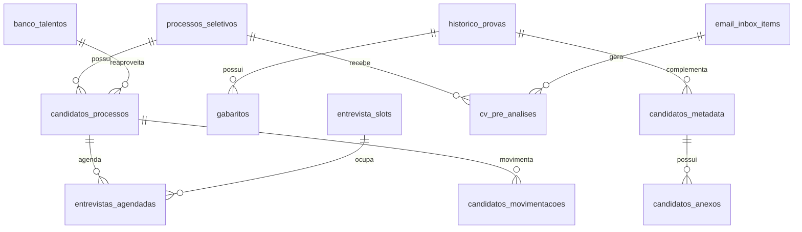

# Documentação Conecta C24h - RH

> Gerado a partir da análise do pacote `RH(20).zip`. Esta documentação descreve o sistema existente, seus fluxos, telas, APIs, banco, código, testes, operação e manual do usuário.

## Fluxo macro

## Processo seletivo

## Candidatura pública

## Análise de CV

## Prova

## Entrevistas

## Casos de uso

## ER funcional simplificado

