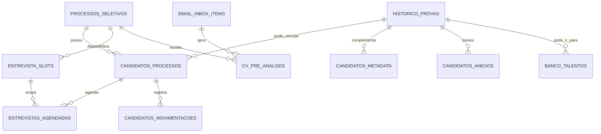

# 05 — Banco de dados

## Banco esperado

O projeto usa SQL Server/SQL Server Express. As configurações são lidas por `.env`, `config.ini` ou variáveis de ambiente.

Variáveis principais:

```env
RH_SQL_SERVER=SERVIDOR\SQLEXPRESS
RH_SQL_DATABASE=RH_Provas_C24H
RH_SQL_DRIVER=ODBC Driver 18 for SQL Server
RH_SQL_TRUSTED_CONNECTION=true
RH_SQL_ENCRYPT=no
RH_SQL_TRUST_SERVER_CERTIFICATE=true
```

## Bootstrap de schema

No startup da API, `bootstrap_runtime_schema(settings)` chama funções que criam ou complementam tabelas/colunas. Isso reduz dependência de intervenção manual em pequenos ajustes de schema.

Tabelas complementares identificadas no bootstrap:

| Tabela | Finalidade |
| --- | --- |
| `historico_provas` | Histórico de provas/testes aplicados |
| `gabaritos` | Arquivos/dados de resposta da prova |
| `processos_seletivos` | Processos/vagas |
| `candidatos_processos` | Relação candidato x processo e status |
| `banco_talentos` | Candidatos reaproveitáveis |
| `candidatos_metadata` | Dados complementares do candidato |
| `candidatos_anexos` | CVs e anexos do candidato |
| `email_inbox_items` | E-mails e anexos processados pela caixa de currículos |
| `entrevistas_agendadas` | Entrevistas marcadas |
| `entrevista_slots` | Slots de agenda disponíveis |
| `cv_pre_analises` | Pré-análise de currículos |
| `candidatos_movimentacoes` | Histórico de movimentações do candidato |

## DER lógico



## Cuidados de banco

1. **Não apagar schema em produção** sem backup.
2. Para reset de testes, prefira limpar dados com critério e resetar identities quando necessário.
3. Alterações de coluna devem ser refletidas nos repositories, schemas e frontend.
4. Erros `Invalid column name` indicam divergência entre código e banco.
5. Erros `08001`/`28000` costumam indicar conexão, driver, autenticação ou permissão SQL.
6. O driver ODBC precisa estar instalado no servidor onde roda a API.

## Observação crítica

O sistema depende de consistência entre:

- nomes de colunas no SQL;
- aliases retornados pelos repositories;
- schemas Pydantic;
- nomes usados pelo frontend.

Qualquer mudança em banco precisa ser rastreada de ponta a ponta.
