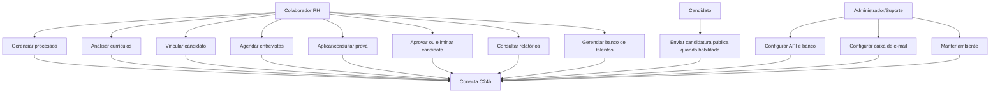
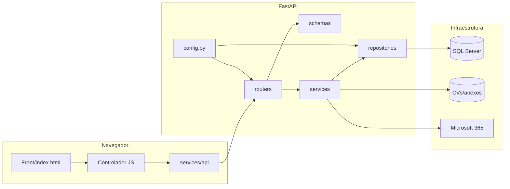
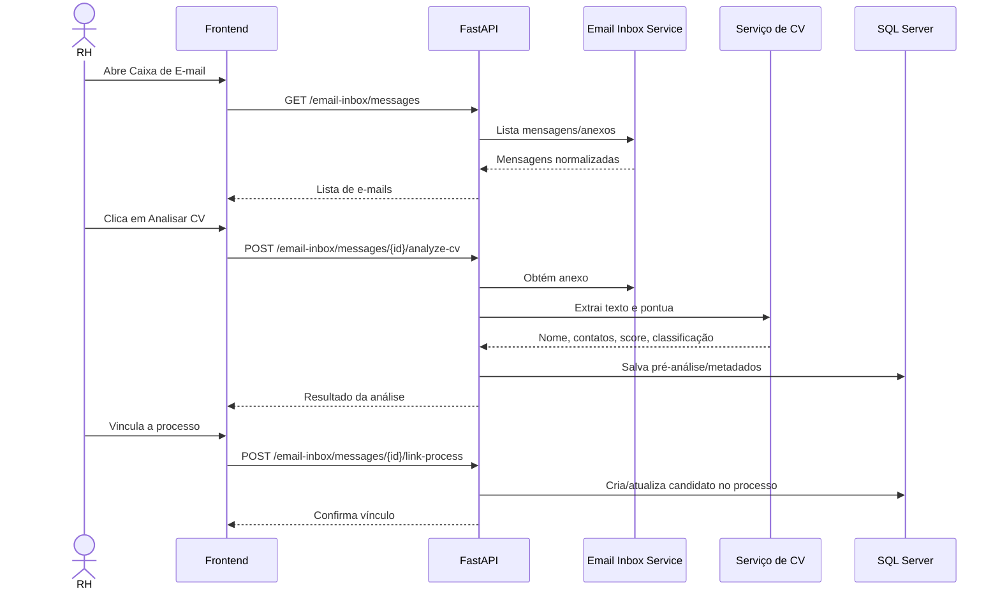
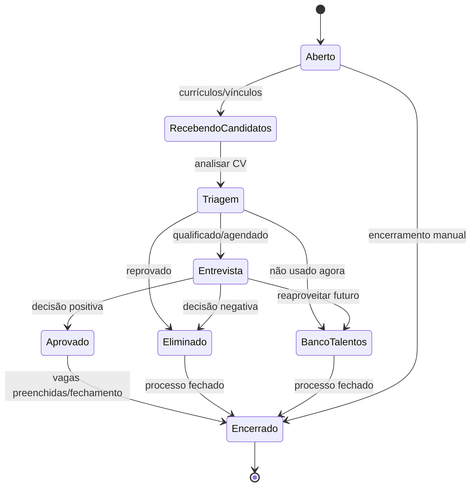
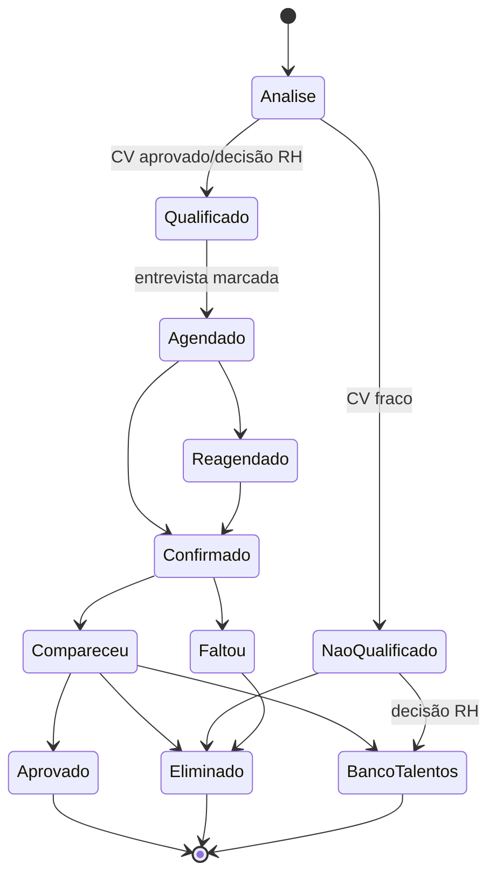
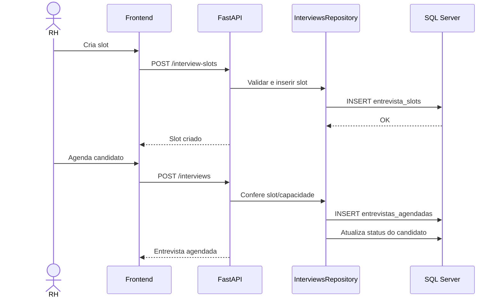
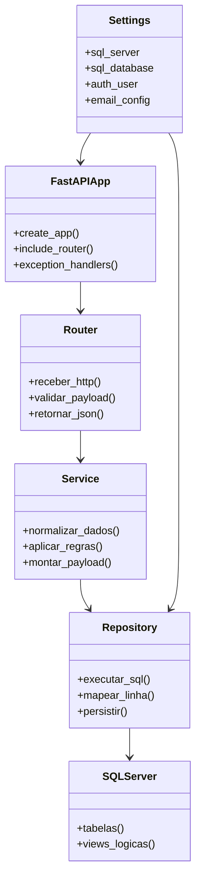
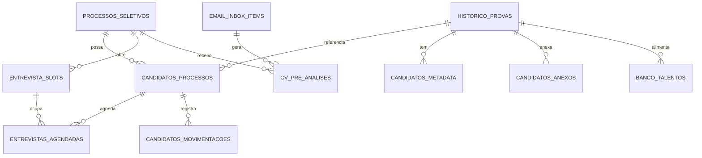

# 11 — Diagramas UML e fluxos

Todos os diagramas abaixo estão em Mermaid. No GitHub, muitos deles renderizam automaticamente em arquivos Markdown. No VS Code, use uma extensão Mermaid para visualizar.

## 1. Diagrama de casos de uso

## 2. Diagrama de componentes

## 3. Fluxo de currículo recebido por e-mail

## 4. Fluxo de processo seletivo

## 5. Estado do candidato

## 6. Fluxo de entrevista e slot

## 7. Diagrama de classes lógico do backend

## 8. DER lógico

