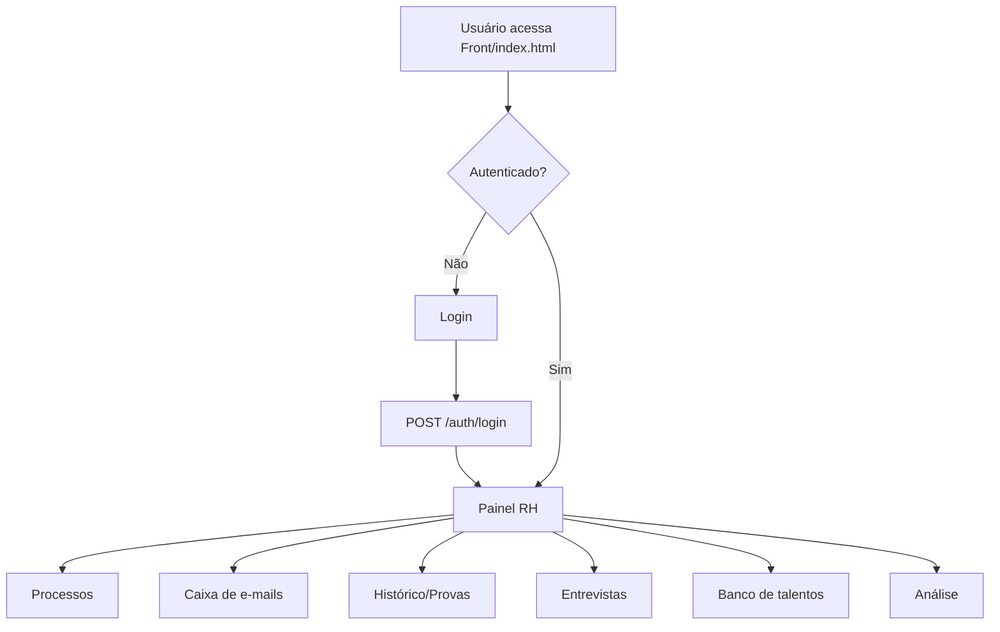
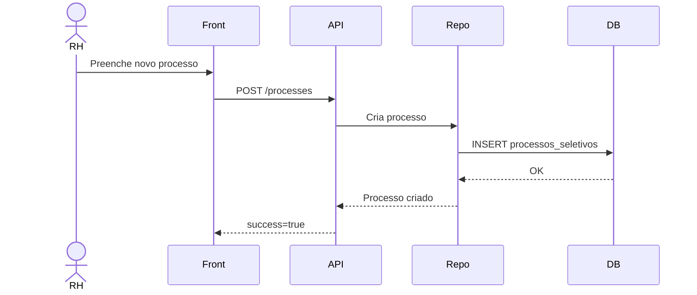
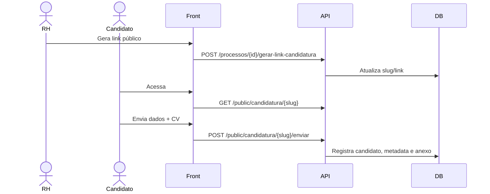
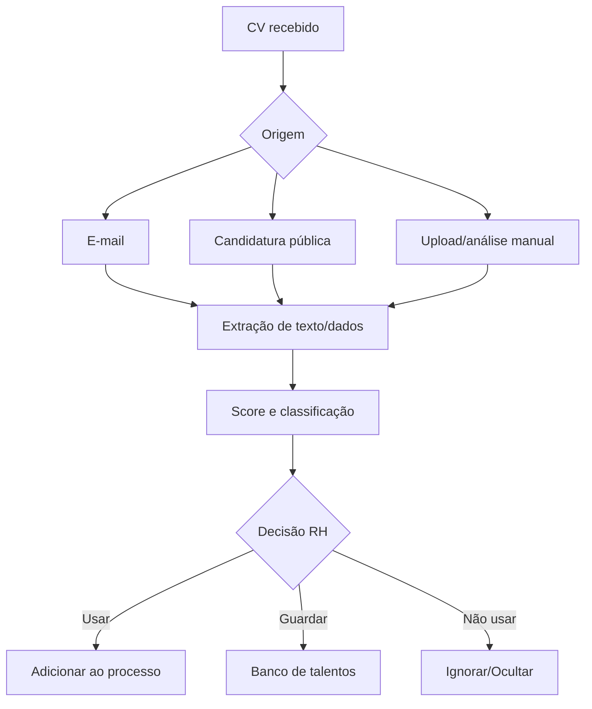
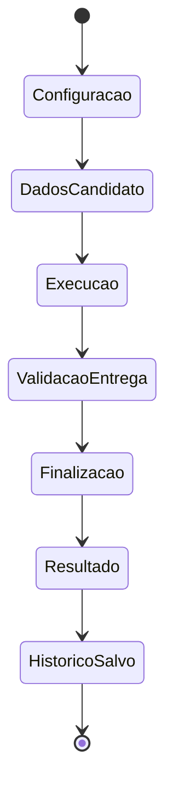
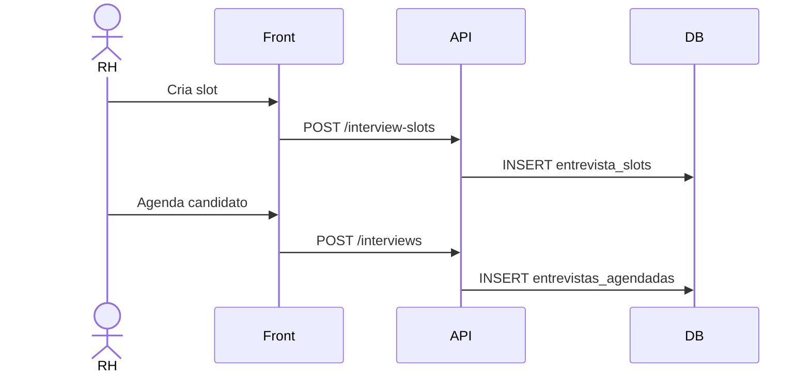
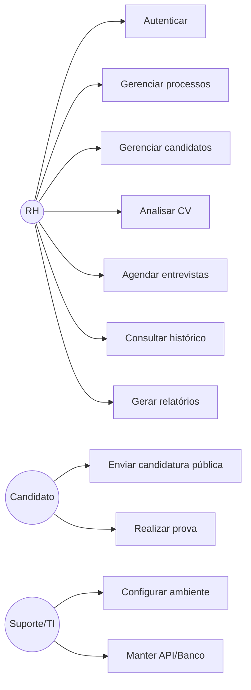
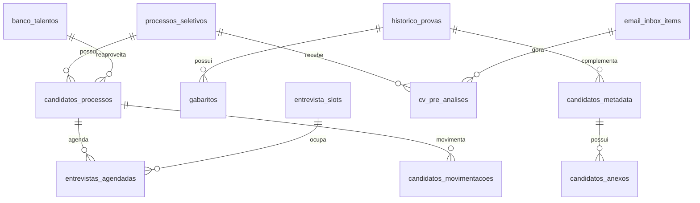

% Documentação Completa - Conecta C24h RH
% Gerado por ChatGPT
% 2026-05-12


\newpage

# Documentação Conecta C24h - RH

> Gerado a partir da análise do pacote `RH(20).zip`. Esta documentação descreve o sistema existente, seus fluxos, telas, APIs, banco, código, testes, operação e manual do usuário.


## Índice

1. `01-visao-geral.md` - visão do produto, objetivo, escopo e módulos.
2. `02-requisitos-e-regras.md` - requisitos funcionais, não funcionais e regras de negócio.
3. `03-arquitetura-e-implantacao.md` - arquitetura, camadas, configuração e operação.
4. `04-fluxos-uml.md` - fluxos macro, UML/Mermaid, casos de uso e ER.
5. `05-mapa-de-telas.md` - telas, rotas, menu e responsabilidades visuais.
6. `06-manual-do-usuario-rh.md` - manual didático para uso pelo RH.
7. `07-api.md` - endpoints e cuidados de manutenção.
8. `08-banco-de-dados.md` - tabelas, relações e cuidados de banco.
9. `09-documentacao-do-codigo.md` - estrutura de código e responsabilidades por arquivo.
10. `10-testes-qa-e-criterios.md` - testes automatizados, QA manual e aceite.
11. `11-seguranca-lgpd-e-operacao.md` - segurança, LGPD, logs e rotinas.
12. `12-roadmap-e-melhorias.md` - backlog recomendado e governança.

## Entregáveis

Além dos arquivos Markdown, há uma versão consolidada em DOCX/PDF para leitura e compartilhamento.


\newpage

# Documentação Conecta C24h - RH

> Gerado a partir da análise do pacote `RH(20).zip`. Esta documentação descreve o sistema existente, seus fluxos, telas, APIs, banco, código, testes, operação e manual do usuário.


## Nome do sistema

**Conecta C24h - RH**.

## Objetivo

Centralizar o processo de recrutamento e seleção da Central 24h, cobrindo abertura de processos, candidatos, provas, análise de currículos, caixa de e-mails, banco de talentos, entrevistas, histórico e relatórios.

## Problema resolvido

O sistema reduz controles espalhados entre e-mails, planilhas, arquivos locais e mensagens. Ele cria uma trilha única para o RH acompanhar origem, status, prova, movimentações e decisões sobre cada candidato.

## Público-alvo

| Perfil | Uso |
|---|---|
| RH/Recrutamento | Operar processos, candidatos, CVs, entrevistas e relatórios. |
| Supervisão/Liderança | Acompanhar candidatos e decisões quando aplicável. |
| Suporte/TI | Manter API, banco, frontend, logs e ambiente. |
| Candidato | Enviar candidatura pública e realizar prova. |

## Módulos

| Módulo | Finalidade |
|---|---|
| Login | Autenticação administrativa. |
| Painel | Entrada principal e atalhos. |
| Caixa de e-mails | Organização dos currículos recebidos por e-mail. |
| Processos | Cadastro, acompanhamento e encerramento de processos. |
| Candidatos | Gestão central dos candidatos e movimentações. |
| Candidatura pública | Link público com envio de currículo. |
| Análise de CV | Extração de dados, score e classificação. |
| Banco de talentos | Reaproveitamento de candidatos. |
| Entrevistas | Slots, agendamentos e status. |
| Provas | Aplicação e cálculo de resultado. |
| Histórico | Consulta de provas e arquivos de resposta. |
| Relatórios | Visões analíticas e exportação. |

## Stack técnica

| Camada | Tecnologia |
|---|---|
| Frontend | HTML, CSS, JavaScript ESM, React via HTM, navegação por hash. |
| Backend | Python, FastAPI, Pydantic, pyodbc. |
| Banco | SQL Server/SQL Server Express. |
| Testes | Pytest com fake repository. |
| Arquivos | Pastas locais para CVs, anexos e planilhas de exame. |


\newpage

# Documentação Conecta C24h - RH

> Gerado a partir da análise do pacote `RH(20).zip`. Esta documentação descreve o sistema existente, seus fluxos, telas, APIs, banco, código, testes, operação e manual do usuário.


## Requisitos funcionais

| Código | Requisito |
|---|---|
| RF01 | Autenticar usuário administrativo do RH. |
| RF02 | Criar, listar, atualizar e encerrar processos seletivos. |
| RF03 | Gerar e desativar link público de candidatura. |
| RF04 | Receber candidatura pública com dados básicos e currículo. |
| RF05 | Listar candidatos vinculados a processos. |
| RF06 | Atualizar status do candidato: análise, aprovado, eliminado, desistente ou banco de talentos. |
| RF07 | Registrar perfil, contato, observações e origem do candidato. |
| RF08 | Analisar CV de e-mail, candidatura pública ou upload/manual. |
| RF09 | Enviar candidato para banco de talentos e reutilizá-lo em processo. |
| RF10 | Criar slots e agendar entrevistas. |
| RF11 | Aplicar prova por vaga, nível e trilha. |
| RF12 | Salvar histórico, gabarito e arquivos de resposta da prova. |
| RF13 | Exibir relatórios de processos e candidatos. |
| RF14 | Exportar relatórios. |
| RF15 | Excluir/ignorar e-mails recebidos quando necessário. |

## Requisitos não funcionais

| Código | Requisito |
|---|---|
| RNF01 | Frontend deve rodar como arquivo estático servido localmente. |
| RNF02 | Backend deve separar routers, schemas, services e repositories. |
| RNF03 | SQL deve ficar nos repositories, não nos routers. |
| RNF04 | Segredos não devem ficar no código-fonte. |
| RNF05 | Erros devem retornar mensagens controladas. |
| RNF06 | Testes devem rodar sem depender do banco real. |
| RNF07 | Sistema deve preservar compatibilidade com imports legados enquanto evolui. |
| RNF08 | Dados pessoais devem ter acesso restrito e retenção controlada. |

## Regras de negócio

### Autenticação

- Módulos administrativos exigem login.
- Endpoints administrativos usam validação do usuário atual.
- Sessão inválida/expirada deve direcionar o usuário ao login.

### Processos

- Processo aberto permite inclusão, análise e entrevista de candidatos.
- Processo encerrado deve bloquear novas movimentações operacionais.
- Link público deve ser invalidado/desativado quando o processo fechar ou quando o RH solicitar.

### Candidatos

- Todo candidato deve ter origem identificável quando possível: página pública, e-mail, análise direta, banco de talentos ou processo único.
- Ações de aprovação, eliminação e envio ao banco devem manter histórico/movimentação.
- Candidato aprovado/eliminado não deve continuar como ativo no fluxo operacional do processo.

### CV

- A análise automática apoia decisão, mas não substitui revisão do RH.
- RH pode usar candidato mesmo com baixa classificação, desde que confirme conscientemente.
- Dados extraídos automaticamente devem poder ser revisados.

### Provas

- Prova considera vaga, nível e trilha.
- Resultado deve salvar nota final, etapas, pendências e observações do RH.
- Entrega incompleta deve gerar alerta ou pendência.

### Entrevistas

- Slot possui capacidade e status.
- Agendamento deve consumir vaga no slot.
- Alterações de status devem ser salvas para acompanhamento.


\newpage

# Documentação Conecta C24h - RH

> Gerado a partir da análise do pacote `RH(20).zip`. Esta documentação descreve o sistema existente, seus fluxos, telas, APIs, banco, código, testes, operação e manual do usuário.


## Arquitetura lógica

```text
Usuário/RH/Candidato
        |
        v
Frontend estático - Front/index.html + JS modular
        |
        v
Cliente HTTP - Front/fonte/services/api/*
        |
        v
Backend FastAPI - api/rh_api/routers/*
        |
        v
Services - api/rh_api/services/*
        |
        v
Repositories - api/rh_api/repositories/*
        |
        v
SQL Server + armazenamento local de arquivos
```

## Camadas do frontend

| Arquivo/Pasta | Papel |
|---|---|
| `Front/index.html` | Entrada da aplicação. |
| `Front/fonte/principal.js` | Inicializa o root. |
| `Front/fonte/aplicacao.js` | Monta a aplicação principal. |
| `Front/fonte/app/aplicacao-raiz.js` | Decide qual tela renderizar. |
| `Front/fonte/app/controlador-aplicacao.js` | Estado, navegação e orquestração. |
| `Front/fonte/features/*` | Telas por domínio. |
| `Front/fonte/services/api/*` | Comunicação HTTP com backend. |
| `Front/fonte/ui/*` | Layout, modais, feedback, tour e busca. |

## Camadas do backend

| Arquivo/Pasta | Papel |
|---|---|
| `api/app.py` | Entrypoint do Uvicorn. |
| `api/rh_api/main.py` | Cria app, middlewares, handlers e routers. |
| `api/rh_api/routers/*` | Endpoints HTTP. |
| `api/rh_api/schemas/*` | Contratos de entrada/saída. |
| `api/rh_api/services/*` | Regras auxiliares. |
| `api/rh_api/repositories/*` | SQL e persistência. |
| `api/rh_api/db.py` | Conexão com SQL Server. |

## Configurações principais

| Configuração | Finalidade |
|---|---|
| `RH_SQL_SERVER` | Servidor/instância SQL. |
| `RH_SQL_DATABASE` | Banco de dados. |
| `RH_SQL_DRIVER` | Driver ODBC. |
| `RH_AUTH_USER` / `RH_AUTH_PASSWORD` | Login local do RH. |
| `RH_AUTH_TOKEN_SECRET` | Segredo do token. |
| `RH_CORS_ALLOW_ORIGINS` | Origens permitidas. |
| `RH_CONFIG_INI` | Caminho opcional para config central. |
| `RH_EMAIL_CLIENT_SECRET` | Segredo da integração de e-mail, idealmente fora do arquivo. |

## Como rodar

### Backend

```powershell
python -m venv .venv
.\.venv\Scripts\Activate.ps1
pip install -r requirements.txt
uvicorn api.app:app --reload --host 127.0.0.1 --port 8000
```

### Frontend

```powershell
python -m http.server 5500
```

Acesso:

```text
http://127.0.0.1:5500/Front/index.html#/login
```

## Implantação recomendada

1. Separar pasta de código de pasta de anexos/CVs.
2. Configurar `.env`/`config.ini` no servidor.
3. Criar venv e instalar dependências.
4. Validar conexão ODBC com SQL Server.
5. Subir API com Uvicorn/serviço.
6. Servir frontend por IIS ou servidor estático.
7. Testar login, processos, CV, e-mails, prova e entrevistas.
8. Configurar backup de banco e arquivos.


\newpage

# Documentação Conecta C24h - RH

> Gerado a partir da análise do pacote `RH(20).zip`. Esta documentação descreve o sistema existente, seus fluxos, telas, APIs, banco, código, testes, operação e manual do usuário.


## Fluxo macro



## Processo seletivo



## Candidatura pública



## Análise de CV



## Prova



## Entrevistas



## Casos de uso



## ER funcional simplificado




\newpage

# Documentação Conecta C24h - RH

> Gerado a partir da análise do pacote `RH(20).zip`. Esta documentação descreve o sistema existente, seus fluxos, telas, APIs, banco, código, testes, operação e manual do usuário.


## Rotas do frontend

| Tela interna | Rota/hash |
|---|---|
| `screen-login` | `#/login` |
| `screen-menu` | `#/inicio` |
| `screen-email-inbox` | `#/caixa-email` |
| `screen-history` | `#/historico` |
| `screen-processes` | `#/processos` |
| `screen-candidates` | `#/candidatos` |
| `screen-candidate-pipeline` | `#/pipeline-candidatos` |
| `screen-process-create` | `#/novo-processo` |
| `screen-process-details` | `#/detalhes-processo` |
| `screen-interviews` | `#/entrevistas` |
| `screen-talent-bank` | `#/banco-talentos` |
| `screen-config` | `#/configuracao` |
| `screen-candidate` | `#/candidato` |
| `screen-exam` | `#/prova` |
| `screen-thanks` | `#/conclusao` |
| `screen-result` | `#/resultado` |
| `screen-analysis-candidates` | `#/analise-candidatos` |
| `screen-public-candidacy` | `#/candidatar` |

## Menu lateral

| Item | Tela | Objetivo |
|---|---|---|
| Painel | `screen-menu` | Entrada principal e atalhos. |
| E-mails | `screen-email-inbox` | Currículos recebidos por e-mail. |
| Histórico | `screen-history` | Provas e resultados. |
| Processos | `screen-processes` | Gestão de processos seletivos. |
| Candidatos | `screen-candidates` | Gestão central de candidatos. |
| Entrevistas | `screen-interviews` | Agenda e slots. |
| Análise | `screen-analysis-candidates` | Pré-análise de CVs/candidatos. |
| Banco de talentos | `screen-talent-bank` | Candidatos reaproveitáveis. |

## Descrição das telas

### Login
Entrada protegida do RH.

### Painel
Resumo operacional e atalhos para novo processo/nova prova.

### Caixa de e-mails
Lista mensagens, abre detalhes, baixa anexos, analisa CV, vincula ao processo, envia ao banco, ignora ou exclui.

### Histórico
Consulta provas finalizadas, resultados e arquivos de resposta.

### Processos
Lista processos, abre detalhe, encerra, gera link público e acompanha candidatos.

### Novo processo
Formulário de abertura de processo com vaga, operação/trilha, datas e observações.

### Candidatos
Visão central para status, aprovação, eliminação, banco de talentos e ações relacionadas.

### Entrevistas
Criação de slots, agendamento, atualização de status e observações.

### Análise
Pré-análise de currículos com score, classificação, dados extraídos e decisão do RH.

### Banco de talentos
Lista candidatos disponíveis para reaproveitamento em processos futuros.

### Prova
Fluxo do candidato: dados, execução, conclusão e resultado.

### Candidatura pública
Rota `#/candidatar/{slug}`, usada por candidatos externos para enviar dados e currículo.


\newpage

# Documentação Conecta C24h - RH

> Gerado a partir da análise do pacote `RH(20).zip`. Esta documentação descreve o sistema existente, seus fluxos, telas, APIs, banco, código, testes, operação e manual do usuário.


# Manual do Usuário RH

## 1. Acessar

1. Abra o endereço do sistema.
2. Informe usuário e senha.
3. Clique em entrar.
4. Confirme se o painel abriu.

## 2. Criar processo

1. Clique em **Novo processo** ou **Processos**.
2. Preencha vaga, operação/trilha quando aplicável, datas, quantidade e observações.
3. Salve.
4. Confira se o processo apareceu na lista.

## 3. Gerar link de candidatura

1. Abra o processo.
2. Clique para gerar link público.
3. Copie o link e envie ao candidato.
4. Encerre/desative o link quando a vaga fechar.

## 4. Acompanhar candidatos

1. Acesse **Processos** ou **Candidatos**.
2. Localize o candidato.
3. Veja origem, status, prova, análise, entrevista e observações.
4. Use as ações apenas quando tiver certeza da decisão.

## 5. Caixa de e-mails

1. Acesse **E-mails**.
2. Abra a mensagem desejada.
3. Baixe anexo quando necessário.
4. Use **Analisar CV** para gerar score/classificação.
5. Vincule ao processo, envie ao banco de talentos, ignore ou exclua conforme o caso.

## 6. Análise de CV

1. Confira nome, e-mail, telefone e texto extraído.
2. Leia classificação e problemas.
3. Decida entre adicionar ao processo, banco de talentos ou descartar/ignorar.
4. Se a análise automática falhar, revise manualmente.

## 7. Banco de talentos

1. Acesse **Banco de talentos**.
2. Escolha candidato.
3. Clique para usar em processo.
4. Selecione processo de destino.
5. Confirme.

## 8. Entrevistas

1. Acesse **Entrevistas**.
2. Crie slots com data, horário e capacidade.
3. Agende candidato aprovado ou apto.
4. Atualize status após comparecimento, ausência ou remarcação.

## 9. Prova

1. Clique em **Nova prova**.
2. Preencha dados do candidato.
3. Confirme vaga, nível e trilha.
4. Inicie a prova.
5. Ao final, salve o resultado.
6. Consulte em **Histórico**.

## 10. Histórico e relatórios

1. Acesse **Histórico** para provas.
2. Use relatórios para visão por processo/candidato.
3. Exporte apenas após validar filtros e datas.

## 11. Erros comuns

| Problema | Ação |
|---|---|
| Sessão expirada | Fazer login novamente. |
| Processo não aparece | Atualizar tela e conferir filtros/status. |
| CV sem nome detectado | Corrigir manualmente antes de usar. |
| API com erro | Enviar print, horário e ação feita ao suporte. |
| Anexo não baixa | Verificar com TI a pasta de anexos. |
| Prova não salva | Não fechar tela; acionar suporte. |

## 12. Boas práticas

- Não aprovar/eliminar sem revisar dados.
- Registrar observações claras.
- Fechar processo quando não estiver mais ativo.
- Usar banco de talentos para bons candidatos fora do momento.
- Tratar a análise automática como apoio, não como decisão final.


\newpage

# Documentação Conecta C24h - RH

> Gerado a partir da análise do pacote `RH(20).zip`. Esta documentação descreve o sistema existente, seus fluxos, telas, APIs, banco, código, testes, operação e manual do usuário.


## Padrão

- API FastAPI.
- Resposta de erro: `{"success": false, "message": "..."}`.
- Endpoints administrativos exigem autenticação.

## Endpoints

| Router | Método | Caminho | Função |
|---|---:|---|---|
| `analytics.py` | GET | `/candidate-analytics` | `get_candidate_analytics` |
| `analytics.py` | GET | `/candidate-analytics/{id_teste}` | `get_candidate_analytics_detail` |
| `analytics.py` | GET | `/reports/processes` | `get_process_report` |
| `analytics.py` | GET | `/reports/processes/export` | `export_process_report` |
| `analytics.py` | GET | `/reports/candidates` | `get_candidate_report` |
| `analytics.py` | GET | `/reports/candidates/export` | `export_candidate_report` |
| `auth.py` | POST | `/auth/login` | `login` |
| `auth.py` | GET | `/auth/me` | `me` |
| `auth.py` | POST | `/auth/logout` | `logout` |
| `email_inbox.py` | GET | `/email-inbox/status` | `get_email_inbox_status` |
| `email_inbox.py` | GET | `/email-inbox/messages` | `list_email_inbox_messages` |
| `email_inbox.py` | GET | `/email-inbox/messages/{item_id}` | `get_email_inbox_message` |
| `email_inbox.py` | POST | `/email-inbox/messages/{item_id}/download-attachments` | `download_email_inbox_attachments` |
| `email_inbox.py` | POST | `/email-inbox/messages/{item_id}/analyze-cv` | `analyze_email_inbox_cv` |
| `email_inbox.py` | POST | `/email-inbox/messages/{item_id}/link-process` | `link_email_inbox_to_process` |
| `email_inbox.py` | POST | `/email-inbox/messages/{item_id}/talent-bank` | `send_email_inbox_to_talent_bank` |
| `email_inbox.py` | POST | `/email-inbox/messages/{item_id}/ignore` | `ignore_email_inbox_item` |
| `email_inbox.py` | DELETE | `/email-inbox/messages/{item_id}` | `delete_email_inbox_item` |
| `email_inbox.py` | GET | `/email-inbox/messages/{item_id}/attachment` | `get_primary_email_inbox_attachment` |
| `email_inbox.py` | GET | `/email-inbox/messages/{item_id}/attachment/{attachment_id}` | `get_email_inbox_attachment` |
| `history.py` | GET | `/history` | `get_history` |
| `history.py` | POST | `/history` | `save_history` |
| `history.py` | GET | `/answer-files` | `get_answer_files` |
| `history.py` | POST | `/answer-files` | `save_answer_file` |
| `interviews.py` | GET | `/interviews` | `get_interviews` |
| `interviews.py` | GET | `/interview-slots` | `get_interview_slots` |
| `interviews.py` | POST | `/interview-slots` | `create_interview_slots` |
| `interviews.py` | PUT | `/interview-slots/{id_slot}` | `update_interview_slot` |
| `interviews.py` | DELETE | `/interview-slots/{id_slot}` | `delete_interview_slot` |
| `interviews.py` | POST | `/interviews` | `create_interview` |
| `interviews.py` | PUT | `/interviews/{id_entrevista}` | `update_interview` |
| `pipeline.py` | GET | `/candidate-pipeline` | `get_candidate_pipeline` |
| `pipeline.py` | POST | `/candidate-pipeline` | `create_candidate_pipeline_card` |
| `pipeline.py` | PUT | `/candidate-pipeline/{id_registro}/stage` | `move_candidate_pipeline_card` |
| `pipeline.py` | DELETE | `/candidate-pipeline/{id_registro}` | `delete_candidate_pipeline_card` |
| `processes.py` | GET | `/processes` | `get_processes` |
| `processes.py` | POST | `/processes` | `create_process` |
| `processes.py` | PUT | `/processes/{id_processo}` | `update_process` |
| `processes.py` | POST | `/processes/{id_processo}/close` | `close_process` |
| `processes.py` | GET | `/process-candidates` | `get_process_candidates` |
| `processes.py` | POST | `/process-candidates` | `create_process_candidate` |
| `processes.py` | PUT | `/process-candidates/{id_registro}/status` | `update_process_candidate_status` |
| `processes.py` | POST | `/process-candidates/{id_registro}/approval-whatsapp` | `record_approval_whatsapp` |
| `processes.py` | POST | `/process-candidates/{id_registro}/approval-email` | `send_approval_email` |
| `processes.py` | GET | `/talent-bank` | `get_talent_bank` |
| `processes.py` | POST | `/talent-bank` | `create_talent_bank_candidate` |
| `processes.py` | DELETE | `/talent-bank/{id_banco}` | `delete_talent_bank_candidate` |
| `processes.py` | POST | `/talent-bank/{id_banco}/use` | `use_talent_bank_candidate` |
| `processes.py` | PUT | `/candidate-profiles/{id_teste}` | `update_candidate_profile` |
| `processes.py` | PUT | `/candidate-profiles/{id_teste}/status` | `update_standalone_candidate_status` |
| `processes.py` | GET | `/processes/{id_processo}/details` | `get_process_details` |
| `processes.py` | GET | `/email-inbox` | `list_email_inbox` |
| `processes.py` | GET | `/email-inbox/{item_id}` | `get_email_inbox_item` |
| `processes.py` | POST | `/email-inbox/{item_id}/analyze-cv` | `analyze_email_inbox_cv` |
| `processes.py` | POST | `/email-inbox/{item_id}/link-process` | `link_email_inbox_to_process` |
| `processes.py` | POST | `/email-inbox/{item_id}/talent-bank` | `send_email_inbox_to_talent_bank` |
| `processes.py` | POST | `/email-inbox/{item_id}/ignore` | `ignore_email_inbox_item` |
| `processes.py` | GET | `/processes/{id_processo}/email-inbox` | `list_process_email_inbox` |
| `processes.py` | POST | `/processes/{id_processo}/email-inbox/analyze-cv` | `analyze_process_email_cv` |
| `processes.py` | POST | `/processos/{id_processo}/gerar-link-candidatura` | `generate_public_application_link` |
| `processes.py` | PATCH | `/processos/{id_processo}/link-candidatura/desativar` | `deactivate_public_application_link` |
| `processes.py` | GET | `/candidate-profiles/{id_teste}/cv` | `download_candidate_cv` |
| `processes.py` | POST | `/candidate-profiles/{id_teste}/analyze-cv` | `analyze_candidate_profile_cv` |
| `processes.py` | GET | `/processes/{id_processo}/cv-pre-analyses` | `list_cv_pre_analyses` |
| `processes.py` | POST | `/processes/{id_processo}/cv-pre-analyses/clear-list` | `clear_cv_pre_analyses_list` |
| `processes.py` | POST | `/processes/{id_processo}/cv-pre-analyses` | `create_cv_pre_analysis` |
| `processes.py` | PUT | `/cv-pre-analyses/{id_pre_analise}` | `update_cv_pre_analysis` |
| `processes.py` | DELETE | `/cv-pre-analyses/{id_pre_analise}` | `delete_cv_pre_analysis` |
| `processes.py` | POST | `/cv-pre-analyses/{id_pre_analise}/add-to-process` | `add_cv_pre_analysis_to_process` |
| `processes.py` | POST | `/cv-pre-analyses/{id_pre_analise}/talent-bank` | `add_cv_pre_analysis_to_talent_bank` |
| `public_candidacy.py` | GET | `/public/candidatura/{slug}` | `get_public_application` |
| `public_candidacy.py` | POST | `/public/candidatura/{slug}/enviar` | `submit_public_application` |
| `system.py` | GET | `/` | `root` |
| `system.py` | GET | `/debug/gabaritos-columns` | `debug_gabaritos_columns` |
| `system.py` | GET | `/debug/historico-provas-columns` | `debug_historico_provas_columns` |

## Cuidados de manutenção

1. Não alterar caminho/contrato sem atualizar frontend.
2. Criar schema em `schemas` para payloads novos.
3. Manter SQL em `repositories`.
4. Adicionar teste em `api/tests`.
5. Conferir CORS ao mudar host/porta do frontend.


\newpage

# Documentação Conecta C24h - RH

> Gerado a partir da análise do pacote `RH(20).zip`. Esta documentação descreve o sistema existente, seus fluxos, telas, APIs, banco, código, testes, operação e manual do usuário.


## Banco

SQL Server via `pyodbc`. O backend garante tabelas complementares em `bootstrap.py`.

## Tabelas principais em uso

- `processos_seletivos`
- `candidatos_processos`
- `historico_provas`
- `gabaritos`
- `banco_talentos`

## Tabelas complementares criadas/garantidas

### `cv_pre_analises`

- `id_pre_analise INT IDENTITY(1,1) PRIMARY KEY`
- `id_processo NVARCHAR(60) NULL`
- `id_processo_ref NVARCHAR(255) NULL`
- `nome_candidato NVARCHAR(255) NULL`
- `email NVARCHAR(255) NULL`
- `telefone NVARCHAR(50) NULL`
- `whatsapp NVARCHAR(50) NULL`
- `palavras_chave NVARCHAR(MAX) NULL`
- `score_final DECIMAL(5,2) NULL`
- `classificacao NVARCHAR(80) NULL`
- `classificacao_slug NVARCHAR(80) NULL`
- `problemas NVARCHAR(MAX) NULL`
- `texto_extraido NVARCHAR(MAX) NULL`
- `nome_arquivo NVARCHAR(255) NULL`
- `mime_type NVARCHAR(120) NULL`
- `arquivo_original_base64 NVARCHAR(MAX) NULL`
- `ja_adicionado_ao_processo BIT NULL`
- `oculto_na_lista BIT NULL`
- `origem NVARCHAR(120) NULL`
- `email_uid NVARCHAR(120) NULL`
- `email_message_id NVARCHAR(255) NULL`
- `email_attachment_name NVARCHAR(255) NULL`
- `email_remetente NVARCHAR(255) NULL`
- `email_assunto NVARCHAR(500) NULL`
- `email_data DATETIME NULL`
- `criado_em DATETIME NULL`

### `candidatos_metadata`

- `id_teste NVARCHAR(120) NOT NULL PRIMARY KEY`
- `nome_candidato NVARCHAR(255) NULL`
- `habilidades_json NVARCHAR(MAX) NULL`
- `tags_json NVARCHAR(MAX) NULL`
- `observacao_rh NVARCHAR(MAX) NULL`
- `email NVARCHAR(255) NULL`
- `telefone NVARCHAR(50) NULL`
- `whatsapp NVARCHAR(50) NULL`
- `cidade NVARCHAR(120) NULL`
- `bairro NVARCHAR(120) NULL`
- `criado_em DATETIME NOT NULL DEFAULT GETDATE()`
- `atualizado_em DATETIME NOT NULL DEFAULT GETDATE()`

### `candidatos_anexos`

- `id_anexo INT IDENTITY(1,1) PRIMARY KEY`
- `id_teste NVARCHAR(120) NULL`
- `id_processo NVARCHAR(60) NULL`
- `id_processo_ref NVARCHAR(255) NULL`
- `nome_arquivo_original NVARCHAR(255) NULL`
- `nome_arquivo_armazenado NVARCHAR(255) NULL`
- `tipo_arquivo NVARCHAR(120) NULL`
- `caminho_arquivo NVARCHAR(500) NULL`
- `tamanho_bytes BIGINT NULL`
- `criado_em DATETIME NULL`
- `atualizado_em DATETIME NULL`

### `email_inbox_items`

- `id NVARCHAR(120) NOT NULL PRIMARY KEY`
- `message_uid NVARCHAR(120) NULL`
- `message_id NVARCHAR(500) NULL`
- `remetente NVARCHAR(500) NULL`
- `remetente_nome NVARCHAR(255) NULL`
- `assunto NVARCHAR(500) NULL`
- `data_recebimento DATETIME NULL`
- `resumo NVARCHAR(MAX) NULL`
- `corpo_texto NVARCHAR(MAX) NULL`
- `nome_detectado NVARCHAR(255) NULL`
- `telefone_detectado NVARCHAR(50) NULL`
- `email_detectado NVARCHAR(255) NULL`
- `vaga_detectada NVARCHAR(255) NULL`
- `status NVARCHAR(80) NULL`
- `origem NVARCHAR(120) NULL`
- `caminho_anexo NVARCHAR(500) NULL`
- `nome_anexo NVARCHAR(255) NULL`
- `content_type NVARCHAR(120) NULL`
- `tamanho_anexo BIGINT NULL`
- `attachments_json NVARCHAR(MAX) NULL`
- `metadata_path NVARCHAR(500) NULL`
- `processo_id NVARCHAR(255) NULL`
- `candidato_id NVARCHAR(120) NULL`
- `id_pre_analise INT NULL`
- `id_registro INT NULL`
- `id_banco INT NULL`
- `criado_em DATETIME NULL`
- `atualizado_em DATETIME NULL`
- `ignorado BIT NULL`

### `candidatos_movimentacoes`

- `id_movimentacao INT IDENTITY(1,1) PRIMARY KEY`
- `id_teste NVARCHAR(120) NULL`
- `id_registro INT NULL`
- `id_processo NVARCHAR(60) NULL`
- `id_processo_ref NVARCHAR(255) NULL`
- `nome_candidato NVARCHAR(255) NULL`
- `vaga NVARCHAR(255) NULL`
- `origem_inicial NVARCHAR(120) NULL`
- `tipo_movimentacao NVARCHAR(120) NULL`
- `status_anterior NVARCHAR(80) NULL`
- `status_novo NVARCHAR(80) NULL`
- `observacao NVARCHAR(MAX) NULL`
- `usuario_responsavel NVARCHAR(120) NULL`
- `processo_destino NVARCHAR(255) NULL`
- `criado_em DATETIME NOT NULL DEFAULT GETDATE()`

### `entrevistas_agendadas`

- `id_entrevista INT IDENTITY(1,1) PRIMARY KEY`
- `id_processo NVARCHAR(60) NULL`
- `id_processo_ref NVARCHAR(255) NULL`
- `id_registro INT NULL`
- `id_teste NVARCHAR(120) NULL`
- `nome_candidato NVARCHAR(255) NULL`
- `vaga NVARCHAR(255) NULL`
- `data_entrevista DATETIME NULL`
- `status_entrevista NVARCHAR(80) NULL`
- `link_agendamento NVARCHAR(MAX) NULL`
- `observacoes_rh NVARCHAR(MAX) NULL`
- `mensagem_base NVARCHAR(MAX) NULL`
- `id_slot INT NULL`
- `mensagem_personalizada NVARCHAR(MAX) NULL`
- `criado_em DATETIME NULL`
- `atualizado_em DATETIME NULL`

### `entrevista_slots`

- `id_slot INT IDENTITY(1,1) PRIMARY KEY`
- `id_processo NVARCHAR(60) NULL`
- `id_processo_ref NVARCHAR(255) NULL`
- `vaga NVARCHAR(255) NULL`
- `inicio DATETIME NULL`
- `fim DATETIME NULL`
- `capacidade_total INT NULL`
- `status_slot NVARCHAR(30) NULL`
- `id_entrevista INT NULL`
- `observacoes_rh NVARCHAR(MAX) NULL`
- `criado_em DATETIME NULL`
- `atualizado_em DATETIME NULL`

## Relações funcionais

| Tabela | Papel |
|---|---|
| `processos_seletivos` | Processo seletivo. |
| `candidatos_processos` | Candidato dentro do processo. |
| `historico_provas` | Resultado/histórico de prova. |
| `gabaritos` | Respostas/arquivos de prova. |
| `candidatos_metadata` | Dados complementares do candidato. |
| `candidatos_anexos` | Currículos e anexos. |
| `cv_pre_analises` | Pré-análises de CV. |
| `email_inbox_items` | E-mails recebidos/importados. |
| `banco_talentos` | Candidatos reaproveitáveis. |
| `entrevista_slots` | Horários disponíveis. |
| `entrevistas_agendadas` | Entrevistas marcadas. |
| `candidatos_movimentacoes` | Histórico de movimentações. |

## Cuidados

- Não inserir manualmente em coluna `IDENTITY`.
- Não dropar tabela sem backup.
- Evitar mudanças diretas em produção.
- Validar `COL_LENGTH`/`OBJECT_ID` no bootstrap ao criar coluna nova.


\newpage

# Documentação Conecta C24h - RH

> Gerado a partir da análise do pacote `RH(20).zip`. Esta documentação descreve o sistema existente, seus fluxos, telas, APIs, banco, código, testes, operação e manual do usuário.


## Estrutura

```text
RH/
├─ Front/       # frontend
├─ api/         # backend FastAPI
├─ data/        # dados/legados/anexos
├─ docs/        # documentação existente
└─ tests        # testes dentro de api/tests
```

## Responsabilidades

| Área | Responsabilidade |
|---|---|
| `Front/estilos` | CSS e imagens. |
| `Front/Exames` | Planilhas de prova. |
| `Front/fonte/app` | Bootstrap, tela atual e controlador. |
| `Front/fonte/features` | Telas de negócio. |
| `Front/fonte/services/api` | Cliente HTTP. |
| `Front/fonte/shared` | Helpers, validações e componentes pequenos. |
| `Front/fonte/ui` | Layout, busca, tour, feedback e modais. |
| `api/rh_api/routers` | Endpoints. |
| `api/rh_api/schemas` | Contratos Pydantic. |
| `api/rh_api/services` | Regras auxiliares. |
| `api/rh_api/repositories` | Persistência e SQL. |

## Arquivos e itens principais

| Arquivo | Funções/classes/exportações |
|---|---|
| `api/rh_api/__init__.py` | arquivo de apoio/configuração |
| `api/rh_api/auth.py` | classe `AuthenticatedUser`, função `_b64encode`, função `_b64decode`, função `_sign`, função `authenticate_credentials`, função `validate_access_token` |
| `api/rh_api/config.py` | função `_load_dotenv`, função `_load_runtime_ini`, função `_ini_value`, função `_ini_bool`, função `_split_csv`, função `_read_bool_env`, classe `Settings`, função `get_settings` |
| `api/rh_api/db.py` | função `_bool_to_connection_value`, função `build_connection_string`, função `get_connection` |
| `api/rh_api/dependencies.py` | função `get_repository`, função `get_current_user` |
| `api/rh_api/logging_config.py` | função `configure_logging` |
| `api/rh_api/main.py` | função `_serialize_validation_value`, função `_serialize_validation_error`, função `_get_validation_message`, função `create_app` |
| `api/rh_api/repositories/__init__.py` | arquivo de apoio/configuração |
| `api/rh_api/repositories/analytics.py` | função `_parse_date_filter`, função `_coerce_datetime`, função `_in_date_range`, função `_format_report_value`, função `_csv_bytes`, função `_report_filename`, classe `AnalyticsRepositoryMixin` |
| `api/rh_api/repositories/base.py` | classe `BaseRepository` |
| `api/rh_api/repositories/bootstrap.py` | função `ensure_cv_pre_analises_table`, função `ensure_pipeline_columns`, função `ensure_candidate_approval_columns`, função `ensure_process_columns`, função `ensure_candidate_metadata_table`, função `ensure_candidate_metadata_columns`, função `ensure_candidate_attachments_table`, função `ensure_email_inbox_items_table`, função `ensure_candidate_movements_table`, função `ensure_interviews_table`, função `ensure_interview_slots_table`, função `_ensure_process_reference_column` |
| `api/rh_api/repositories/communications.py` | função `_decode_header_value`, função `_extract_first_email`, função `_attachment_extension`, função `_safe_email_item_id`, função `_email_candidate_id`, função `_parse_metadata_datetime`, classe `CommunicationRepositoryMixin` |
| `api/rh_api/repositories/cv_analysis.py` | classe `CvAnalysisRepositoryMixin` |
| `api/rh_api/repositories/db_repository.py` | classe `DatabaseRepository` |
| `api/rh_api/repositories/email_inbox.py` | função `_parse_datetime`, função `_format_datetime`, função `_friendly_detected`, classe `EmailInboxRepositoryMixin` |
| `api/rh_api/repositories/history.py` | arquivo de apoio/configuração |
| `api/rh_api/repositories/interviews.py` | classe `InterviewRepositoryMixin` |
| `api/rh_api/repositories/pipeline.py` | classe `PipelineRepositoryMixin` |
| `api/rh_api/repositories/processes.py` | classe `ProcessRepositoryMixin` |
| `api/rh_api/repositories/profiles.py` | classe `CandidateProfileRepositoryMixin` |
| `api/rh_api/repositories/public_candidacy.py` | classe `PublicCandidacyRepositoryMixin` |
| `api/rh_api/repositories/talent_bank.py` | classe `TalentBankRepositoryMixin` |
| `api/rh_api/routers/analytics.py` | função `get_candidate_analytics`, função `get_candidate_analytics_detail`, função `get_process_report`, função `export_process_report`, função `get_candidate_report`, função `export_candidate_report` |
| `api/rh_api/routers/auth.py` | função `login`, função `me`, função `logout` |
| `api/rh_api/routers/email_inbox.py` | função `get_email_inbox_status`, função `list_email_inbox_messages`, função `get_email_inbox_message`, função `download_email_inbox_attachments`, função `analyze_email_inbox_cv`, função `link_email_inbox_to_process`, função `send_email_inbox_to_talent_bank`, função `ignore_email_inbox_item`, função `delete_email_inbox_item`, função `get_primary_email_inbox_attachment`, função `get_email_inbox_attachment` |
| `api/rh_api/routers/history.py` | função `_build_safe_payload_preview`, função `get_history`, função `save_history`, função `get_answer_files`, função `save_answer_file` |
| `api/rh_api/routers/interviews.py` | função `get_interviews`, função `get_interview_slots`, função `create_interview_slots`, função `update_interview_slot`, função `delete_interview_slot`, função `create_interview`, função `update_interview` |
| `api/rh_api/routers/pipeline.py` | função `get_candidate_pipeline`, função `create_candidate_pipeline_card`, função `move_candidate_pipeline_card`, função `delete_candidate_pipeline_card` |
| `api/rh_api/routers/processes.py` | função `get_processes`, função `create_process`, função `update_process`, função `close_process`, função `get_process_candidates`, função `create_process_candidate`, função `update_process_candidate_status`, função `record_approval_whatsapp`, função `send_approval_email`, função `get_talent_bank`, função `create_talent_bank_candidate`, função `delete_talent_bank_candidate` |
| `api/rh_api/routers/public_candidacy.py` | função `get_public_application`, função `submit_public_application` |
| `api/rh_api/routers/system.py` | função `root`, função `debug_gabaritos_columns`, função `debug_historico_provas_columns` |
| `api/rh_api/schemas/auth.py` | classe `LoginRequest`, classe `LoginResponse`, classe `SessionResponse` |
| `api/rh_api/schemas/common.py` | classe `BaseSchema`, classe `SuccessResponse`, classe `ErrorResponse` |
| `api/rh_api/schemas/history.py` | classe `HistoryRecordRequest`, classe `AnswerFileRequest` |
| `api/rh_api/schemas/interviews.py` | arquivo de apoio/configuração |
| `api/rh_api/schemas/pipeline.py` | classe `PipelineCardCreateRequest`, classe `PipelineCardMoveRequest` |
| `api/rh_api/schemas/processes.py` | classe `ProcessCreateRequest`, classe `ProcessUpdateRequest`, classe `ProcessCandidateCreateRequest`, classe `ProcessCandidateStatusUpdateRequest`, classe `StandaloneCandidateStatusUpdateRequest`, classe `TalentBankUseRequest`, classe `TalentBankCreateRequest`, classe `CvPreAnalysisUpdateRequest`, classe `CandidateProfileUpdateRequest` |
| `api/rh_api/services/analytics.py` | função `clean_analysis_text`, função `extract_analysis_text`, função `score_text_quality`, função `build_stage_expectation`, função `build_analysis_from_payload` |
| `api/rh_api/services/cv.py` | classe `CvTextExtractionError`, função `normalize_cv_text`, função `extract_email`, função `extract_phone`, função `extract_whatsapp`, função `is_valid_candidate_name`, função `_clean_candidate_name`, função `is_valid_email`, função `sanitize_phone`, função `is_valid_phone`, função `extract_education_strength`, função `has_experience_content` |
| `api/rh_api/services/email_inbox_service.py` | classe `EmailInboxUnavailable`, função `_decode_header_value`, função `_first_email`, função `_first_sender_name`, função `_attachment_extension`, função `_clean_filename`, função `_looks_like_person_name`, função `_strip_cv_words`, função `_parse_message_datetime`, função `_iso_datetime`, classe `EmailInboxService` |
| `api/rh_api/services/helpers.py` | função `rows_to_dicts`, função `normalize_text`, função `normalize_compare_text`, função `parse_float_br`, função `safe_json_loads`, função `normalize_string_list` |
| `api/rh_api/services/interviews.py` | função `normalize_interview_status`, função `format_interview_datetime`, função `split_interview_datetime`, função `build_interview_message` |
| `api/rh_api/services/pipeline.py` | função `normalize_pipeline_stage`, função `infer_pipeline_stage`, função `map_pipeline_stage_to_status`, função `build_pipeline_update_payload` |
| `api/rh_api/services/process_flow.py` | função `normalize_process_status`, função `is_process_closed`, função `canonicalize_candidate_status`, função `get_candidate_visible_status`, função `is_terminal_candidate_status`, função `is_active_candidate_status`, função `status_allows_final_decision`, função `status_allows_interview_scheduling`, função `map_cv_classification_to_status`, função `build_process_closed_message`, função `build_candidate_status_action_label`, função `build_approved_candidate_locked_message` |
| `api/rh_api/services/public_candidacy.py` | classe `ValidatedPublicCvUpload`, função `slugify_public_text`, função `generate_public_token`, função `build_public_process_slug`, função `resolve_public_frontend_base_url`, função `normalize_public_application_base_url`, função `resolve_public_candidate_base_url`, função `build_public_application_url`, função `_public_config_items_from_json`, função `resolve_public_process_description`, função `resolve_public_process_requirements`, função `resolve_public_process_responsibilities` |
| `api/rh_api/services/public_job_texts.py` | função `_resolve_job_key`, função `get_default_public_job_texts` |
| `Front/fonte/aplicacao.js` | arquivo de apoio/configuração |
| `Front/fonte/app/aplicacao-raiz.js` | `resolverTelaProtegida`, `Aplicacao` |
| `Front/fonte/app/controlador-aplicacao.js` | `TAMANHO_RECENTES`, `TAMANHO_HISTORICO`, `TAMANHO_ANALISE`, `TAMANHO_DETALHE_PROCESSO`, `criarEstadoInicial`, `hidratarEstado`, `persistirEstado`, `limparEstadoPersistido`, `navegarParaTela`, `usarTelaAtual`, `obterRegrasFormularioProcesso`, `obterAbreviacaoVaga` |
| `Front/fonte/dados-excel/dados.js` | `DADOS_EXCEL_BASE` |
| `Front/fonte/dados-excel/mailing.js` | `MAILING_EXCEL_BASE` |
| `Front/fonte/features/candidatos/index.js` | `normalizarTexto`, `candidatoEstaAprovado`, `obterEstadoAcoesCentral`, `possuiReferenciaProcessoReal`, `candidatoPodeAtrelar`, `renderizarAcoesCandidatoCentral`, `renderizarAcoesRapidasDetalhe`, `montarChaveCandidato`, `obterNotaCandidato`, `obterContatoPrincipal`, `obterClassificacaoCandidato`, `obterDataCandidato` |
| `Front/fonte/features/entrevistas/index.js` | `hojeIsoLocal`, `normalizarTexto`, `formatarHorarioSlot`, `obterSlotDisponivel`, `obterClasseStatusSlot`, `formatarOcupacaoSlot`, `TelaEntrevistas` |
| `Front/fonte/features/gestao/components/filtros.js` | `BlocoFiltro`, `CampoFiltro` |
| `Front/fonte/features/gestao/index.js` | `normalizarTextoPainel`, `obterClasseStatusEmail`, `obterClasseAlertaEmail`, `SecaoCurriculosRecebidosEmail`, `TelaLogin`, `TelaInicio`, `TelaCaixaEmail`, `TelaHistorico`, `TelaCriarProcesso`, `TelaBancoTalentos`, `GraficoComparativoAnalise`, `TelaAnaliseCandidatos` |
| `Front/fonte/features/infraestrutura-react.js` | arquivo de apoio/configuração |
| `Front/fonte/features/pipeline/index.js` | `indiceEtapa`, `obterEstadoAcoesCard`, `TelaPipelineCandidatos` |
| `Front/fonte/features/processos/components/section-toggle.js` | `CabecalhoSecaoColapsavel` |
| `Front/fonte/features/processos/index.js` | `normalizarTextoComparacao`, `obterNotaProvaCandidato`, `formatarOrigemCandidato`, `montarFormularioCandidato`, `candidatoTemProvaSalva`, `montarItensPublicosPadrao`, `normalizarItensPublicos`, `serializarItensPublicos`, `isPreAnaliseNaoQualificada`, `isPreAnaliseUtilizavelDireto`, `lerProblemasCv`, `montarCandidatoDeFluxo` |
| `Front/fonte/features/processos/state.js` | `CHAVE_PROCESSO_DETALHE`, `CHAVE_PIPELINE_PROCESSO`, `CHAVE_PIPELINE_CANDIDATO` |
| `Front/fonte/features/processos-estado.js` | arquivo de apoio/configuração |
| `Front/fonte/features/prova/index.js` | `normalizarTexto`, `montarIdentificadorCandidatoAgendado`, `deduplicarCandidatosAgendados`, `ModalAcessoAdministrativo`, `TelaConfiguracao`, `TelaCandidato`, `TelaProva`, `TelaConclusao`, `TelaResultado` |
| `Front/fonte/features/prova/services/excel-base-data.js` | `obterDadosBaseExcel` |
| `Front/fonte/features/public-candidacy/index.js` | `quebrarTextoEmLinhas`, `TelaCandidaturaPublica` |
| `Front/fonte/features/tela-entrevistas.js` | arquivo de apoio/configuração |
| `Front/fonte/features/tela-pipeline.js` | arquivo de apoio/configuração |
| `Front/fonte/features/telas-gestao.js` | arquivo de apoio/configuração |
| `Front/fonte/features/telas-processos.js` | arquivo de apoio/configuração |
| `Front/fonte/features/telas-prova.js` | arquivo de apoio/configuração |
| `Front/fonte/infraestrutura-react.js` | arquivo de apoio/configuração |
| `Front/fonte/logger.js` | `escrever`, `criarLogger` |
| `Front/fonte/perguntas.js` | `wordQ`, `mcqQ`, `excelExternalQ`, `wordBasicPool`, `wordBasicLevel3Pool`, `wordAdvancedPool`, `generalBasicPool`, `generalAdvPeoplePool`, `generalAdvancedPool`, `techTiBasicPool`, `techRhBasicPool`, `techAdmBasicPool` |
| `Front/fonte/principal.js` | `renderizarFalhaInicializacao`, `iniciarAplicacao` |
| `Front/fonte/regras-prova.js` | `obterBibliotecaXlsx`, `criarResultadoPontuacao`, `criarResultadoChecklist`, `resumirConclusaoChecklist`, `possuiValidacaoExcelImplementada`, `obterPlanilha`, `obterValorCelula`, `obterCelula`, `celulaTemDados`, `planilhaTemAutofiltro`, `adicionarLinhas`, `converterMatrizParaPlanilha` |
| `Front/fonte/rotas.js` | `ROTAS_POR_TELA`, `TELAS_POR_ROTA`, `obterRotaPorTela`, `obterTelaPorHash`, `montarHashDaTela`, `obterSlugCandidaturaPorHash`, `montarHashCandidatura` |
| `Front/fonte/services/api/analytics.js` | `lerAnalisesCandidatos`, `lerDetalheAnaliseCandidato`, `montarParametrosRelatorio`, `lerRelatorioProcessos`, `baixarRelatorioProcessos`, `lerRelatorioCandidatos`, `baixarRelatorioCandidatos` |
| `Front/fonte/services/api/auth.js` | `fazerLoginApi`, `verificarSessaoApi`, `encerrarSessaoApi` |
| `Front/fonte/services/api/core.js` | `URL_PUBLICA_BASE_CANDIDATURA`, `EVENTO_AUTENTICACAO_EXPIRADA`, `lerCache`, `gravarCache`, `lerSessaoAutenticacao`, `salvarSessaoAutenticacao`, `limparSessaoAutenticacao`, `possuiSessaoAutenticada`, `notificarSessaoExpirada`, `lerMensagemErro`, `executarRequisicao`, `extrairNomeArquivo` |
| `Front/fonte/services/api/history.js` | `lerHistorico`, `lerHistoricoPaginado`, `salvarHistorico`, `lerArquivosResposta`, `salvarArquivoResposta` |
| `Front/fonte/services/api/interviews.js` | `lerEntrevistas`, `lerSlotsEntrevista`, `criarSlotsEntrevista`, `atualizarSlotEntrevista`, `excluirSlotEntrevista`, `agendarEntrevista`, `atualizarEntrevista` |
| `Front/fonte/services/api/pipeline.js` | `lerPipelineCandidatos`, `criarCardPipeline`, `moverCardPipeline`, `excluirCardPipeline` |
| `Front/fonte/services/api/processes.js` | `lerProcessos`, `criarProcesso`, `atualizarProcesso`, `encerrarProcesso`, `lerCandidatosProcessos`, `criarCandidatoNoProcesso`, `atualizarStatusCandidato`, `atualizarStatusCandidatoAvulso`, `lerBancoTalentos`, `removerBancoTalentos`, `criarBancoTalentos`, `atualizarPerfilCandidato` |
| `Front/fonte/services/api/public-candidacy.js` | `lerPaginaPublicaCandidatura`, `enviarCandidaturaPublica` |
| `Front/fonte/servico-api.js` | `criarBancoTalentos` |
| `Front/fonte/shared/browser-utils.js` | `copiarTexto`, `toDatetimeLocal`, `montarUrlPublicaCandidatura`, `obterBasePublicaCandidatura`, `abrirBlobEmNovaGuia` |
| `Front/fonte/shared/components/actions.js` | `AcaoSair` |
| `Front/fonte/shared/components/approval-modal.js` | `DOCUMENTOS_APROVACAO_PADRAO`, `formatarDataComparecimento`, `montarListaDocumentos`, `montarMensagemAprovacaoPadrao`, `atualizarDocumentosNaMensagem`, `atualizarDataNaMensagem`, `validarAnexoAprovacao`, `lerArquivoComoBase64`, `ModalAprovacaoCandidato` |
| `Front/fonte/shared/components/empty-table-row.js` | `TabelaVazia` |
| `Front/fonte/shared/helpers-visuais.js` | `formatarTempoRestante`, `formatarNotaVisual`, `obterClasseEtapaResultado`, `obterClasseStatusProcesso`, `obterClasseStatusEntrevista`, `formatarDataHora`, `montarDescricaoFluxo`, `obterClasseAderencia`, `montarResumoAnaliticoCv` |
| `Front/fonte/shared/process-flow.js` | `normalizeCompareText`, `normalizeProcessStatus`, `isProcessClosed`, `canonicalizeCandidateStatus`, `getCandidateVisibleStatus`, `isTerminalCandidateStatus`, `isActiveCandidateStatus`, `isStandaloneCandidate`, `getCandidateActionState`, `getCandidateFlowGroup`, `getPipelineStageLabel` |
| `Front/fonte/shared/process-reference.js` | `normalizarValor`, `obterReferenciaProcesso`, `obterIdVisualProcesso`, `obterChaveProcesso`, `mesmoProcesso`, `encontrarProcessoPorReferencia`, `montarPayloadProcessoSelecionado`, `obterReferenciaProcessoDoCandidato` |
| `Front/fonte/shared/tour-config.js` | `montarSeletor`, `obterTourDaTela`, `obterTourLogin` |
| `Front/fonte/shared/validacoes.js` | `normalizarTexto`, `quebrarListaTexto`, `validarFormularioProcesso`, `validarCardPipeline`, `validarFormularioEntrevista`, `validarPerfilCandidato` |
| `Front/fonte/ui/busca-global.js` | `CHAVE_REQUISITO_BUSCA`, `normalizarBusca`, `montarTextoBusca`, `carregarIndiceBuscaGlobal`, `filtrarResultados`, `rotuloTipo`, `selecionarResultado`, `BuscaGlobalTopbar` |
| `Front/fonte/ui/componentes-compartilhados.js` | arquivo de apoio/configuração |
| `Front/fonte/ui/components/exam-fields.js` | `escaparHtml`, `normalizarConteudoRichText`, `limparHtmlVazio`, `EditorTextoRich`, `PerguntaMultipla`, `PerguntaExcel` |
| `Front/fonte/ui/components/feedback.js` | `BotaoPaginacao`, `GrupoPaginacao`, `MetricGrid`, `EmptyState`, `LoadingState` |
| `Front/fonte/ui/components/layout.js` | `BarraLateral`, `PageIntro`, `SectionCard`, `PainelRh` |
| `Front/fonte/ui/components/modals.js` | `ModalPadrao`, `ModalDetalhesProva` |
| `Front/fonte/ui/tour-guiado.js` | `montarChaveTour`, `clamp`, `calcularPosicao`, `BotaoAjudaTour`, `TourGuiado` |
| `Front/fonte/utilitarios.js` | `sanitizarNomeArquivo`, `removerHtml`, `escaparHtml`, `textoMaiusculoSeguro`, `contarFrases`, `contarItensListaNoHtml`, `formatarDataParaInput`, `obterItensPaginados`, `construirModeloPaginacao`, `formatarNotaAnalise`, `formatarPercentualAfinidade`, `formatarNotaDetalhe` |

## Inventário de arquivos relevantes

- `.edge-dom-inicio.html`
- `.env`
- `.env.example`
- `.gitignore`
- `.uvicorn.err.log`
- `.uvicorn.out.log`
- `Front/Exames/exame_avancado.xlsx`
- `Front/Exames/exame_avancado_nvl2.xlsx`
- `Front/Exames/exame_basico.xlsx`
- `Front/Exames/exame_medio.xlsx`
- `Front/README.md`
- `Front/debug-artifacts/exame_basico_resolvido.xlsx`
- `Front/estilos/Conexa_logo_branca.png`
- `Front/estilos/Fundo-azul.png`
- `Front/estilos/base.css`
- `Front/estilos/estilos.css`
- `Front/estilos/fundo-login.png`
- `Front/estilos/fundo-rh.png`
- `Front/estilos/layout.css`
- `Front/estilos/logo-central24.jpg`
- `Front/estilos/logo-conecta-c24h-branca.png`
- `Front/estilos/logo-conecta-c24h.png`
- `Front/estilos/logo-conexa.png`
- `Front/estilos/logo_conecta_branco.png`
- `Front/estilos/logo_conecta_padrao.png`
- `Front/estilos/print.css`
- `Front/estilos/screens.css`
- `Front/estilos/tokens.css`
- `Front/fonte/aplicacao.js`
- `Front/fonte/app/aplicacao-raiz.js`
- `Front/fonte/app/controlador-aplicacao.js`
- `Front/fonte/dados-excel/dados.js`
- `Front/fonte/dados-excel/mailing.js`
- `Front/fonte/features/candidatos/index.js`
- `Front/fonte/features/entrevistas/index.js`
- `Front/fonte/features/gestao/components/filtros.js`
- `Front/fonte/features/gestao/index.js`
- `Front/fonte/features/infraestrutura-react.js`
- `Front/fonte/features/pipeline/index.js`
- `Front/fonte/features/processos/components/section-toggle.js`
- `Front/fonte/features/processos/index.js`
- `Front/fonte/features/processos/state.js`
- `Front/fonte/features/processos-estado.js`
- `Front/fonte/features/prova/index.js`
- `Front/fonte/features/prova/services/excel-base-data.js`
- `Front/fonte/features/public-candidacy/index.js`
- `Front/fonte/features/tela-entrevistas.js`
- `Front/fonte/features/tela-pipeline.js`
- `Front/fonte/features/telas-gestao.js`
- `Front/fonte/features/telas-processos.js`
- `Front/fonte/features/telas-prova.js`
- `Front/fonte/infraestrutura-react.js`
- `Front/fonte/logger.js`
- `Front/fonte/perguntas.js`
- `Front/fonte/principal.js`
- `Front/fonte/regras-prova.js`
- `Front/fonte/rotas.js`
- `Front/fonte/services/api/analytics.js`
- `Front/fonte/services/api/auth.js`
- `Front/fonte/services/api/core.js`
- `Front/fonte/services/api/history.js`
- `Front/fonte/services/api/interviews.js`
- `Front/fonte/services/api/pipeline.js`
- `Front/fonte/services/api/processes.js`
- `Front/fonte/services/api/public-candidacy.js`
- `Front/fonte/servico-api.js`
- `Front/fonte/shared/browser-utils.js`
- `Front/fonte/shared/components/actions.js`
- `Front/fonte/shared/components/approval-modal.js`
- `Front/fonte/shared/components/empty-table-row.js`
- `Front/fonte/shared/helpers-visuais.js`
- `Front/fonte/shared/process-flow.js`
- `Front/fonte/shared/process-reference.js`
- `Front/fonte/shared/tour-config.js`
- `Front/fonte/shared/validacoes.js`
- `Front/fonte/types/api.ts`
- `Front/fonte/types/models.ts`
- `Front/fonte/types/runtime.d.ts`
- `Front/fonte/ui/busca-global.js`
- `Front/fonte/ui/componentes-compartilhados.js`
- `Front/fonte/ui/components/exam-fields.js`
- `Front/fonte/ui/components/feedback.js`
- `Front/fonte/ui/components/layout.js`
- `Front/fonte/ui/components/modals.js`
- `Front/fonte/ui/tour-guiado.js`
- `Front/fonte/utilitarios.js`
- `Front/index.html`
- `Front/runtime-config.js`
- `Front/tsconfig.json`
- `README.md`
- `api/.idea/workspace.xml`
- `api/README.md`
- `api/app.py`
- `api/debug_db_schema.py`
- `api/requirements.txt`
- `api/rh_api/__init__.py`
- `api/rh_api/auth.py`
- `api/rh_api/config.py`
- `api/rh_api/db.py`
- `api/rh_api/dependencies.py`
- `api/rh_api/logging_config.py`
- `api/rh_api/main.py`
- `api/rh_api/repositories/__init__.py`
- `api/rh_api/repositories/analytics.py`
- `api/rh_api/repositories/base.py`
- `api/rh_api/repositories/bootstrap.py`
- `api/rh_api/repositories/communications.py`
- `api/rh_api/repositories/cv_analysis.py`
- `api/rh_api/repositories/db_repository.py`
- `api/rh_api/repositories/email_inbox.py`
- `api/rh_api/repositories/history.py`
- `api/rh_api/repositories/interviews.py`
- `api/rh_api/repositories/pipeline.py`
- `api/rh_api/repositories/processes.py`
- `api/rh_api/repositories/profiles.py`
- `api/rh_api/repositories/public_candidacy.py`
- `api/rh_api/repositories/talent_bank.py`
- `api/rh_api/routers/analytics.py`
- `api/rh_api/routers/auth.py`
- `api/rh_api/routers/email_inbox.py`
- `api/rh_api/routers/history.py`
- `api/rh_api/routers/interviews.py`
- `api/rh_api/routers/pipeline.py`
- `api/rh_api/routers/processes.py`
- `api/rh_api/routers/public_candidacy.py`
- `api/rh_api/routers/system.py`
- `api/rh_api/schemas/auth.py`
- `api/rh_api/schemas/common.py`
- `api/rh_api/schemas/history.py`
- `api/rh_api/schemas/interviews.py`
- `api/rh_api/schemas/pipeline.py`
- `api/rh_api/schemas/processes.py`
- `api/rh_api/services/analytics.py`
- `api/rh_api/services/cv.py`
- `api/rh_api/services/email_inbox_service.py`
- `api/rh_api/services/helpers.py`
- `api/rh_api/services/interviews.py`
- `api/rh_api/services/pipeline.py`
- `api/rh_api/services/process_flow.py`
- `api/rh_api/services/public_candidacy.py`
- `api/rh_api/services/public_job_texts.py`
- `api/tests/__init__.py`
- `api/tests/conftest.py`
- `api/tests/test_auth_and_pipeline.py`
- `api/tests/test_cv_extraction.py`
- `api/tests/test_history_and_process_rules.py`
- `api/tests/test_interview_schema.py`
- `api/tests/test_public_candidacy.py`
- `data/README.md`
- `data/legacy/access/rh_provas.accdb`
- `docs/README.md`
- `docs/arquitetura.md`
- `docs/entrega-pagina-publica-cv.md`
- `docs/estrutura-do-projeto.md`
- `docs/guia-de-manutencao.md`
- `docs/guia-para-novo-mantenedor.md`
- `docs/legacy/01-visao-geral.md`
- `docs/legacy/02-requisitos.md`
- `docs/legacy/03-regras-de-negocio.md`
- `docs/legacy/04-fluxos-do-sistema.md`
- `docs/legacy/05-arquitetura.md`
- `docs/legacy/06-banco-de-dados.md`
- `docs/legacy/07-api.md`
- `docs/legacy/08-manual-usuario-rh.md`
- `docs/legacy/09-manual-administrador-suporte.md`
- `docs/legacy/10-implantacao.md`
- `docs/legacy/11-manutencao.md`
- `docs/legacy/12-testes.md`
- `docs/legacy/13-changelog.md`
- `docs/legacy/14-seguranca.md`
- `docs/legacy/15-codigo-e-readme-tecnico.md`
- `docs/legacy/README.md`
- `docs/testes.md`
- `pytest.ini`
- `requirements.txt`

## Como alterar com segurança

### Tela
1. Localize a tela em `Front/fonte/features`.
2. Ajuste JS/HTML renderizado.
3. Ajuste CSS em `Front/estilos`.
4. Teste rota por hash.

### Endpoint
1. Criar/alterar schema.
2. Criar/alterar router.
3. Aplicar regra em service quando necessário.
4. Persistir via repository.
5. Expor chamada no frontend.
6. Criar teste.

### Banco
1. Verificar tabela atual.
2. Atualizar bootstrap com alteração incremental.
3. Atualizar repository.
4. Testar em homologação.

## Pontos críticos

- `Front/fonte/app/controlador-aplicacao.js`: estado e orquestração do frontend.
- `Front/fonte/servico-api.js`: fachada de compatibilidade da API no frontend.
- `api/rh_api/main.py`: configuração da FastAPI, CORS, handlers e routers.
- `api/rh_api/config.py`: leitura de `.env`, `config.ini` e variáveis.
- `api/rh_api/repositories/bootstrap.py`: evolução de schema.
- `api/rh_api/repositories/db_repository.py`: fachada legada; evitar colocar regra nova nela quando existir repository específico.


\newpage

# Documentação Conecta C24h - RH

> Gerado a partir da análise do pacote `RH(20).zip`. Esta documentação descreve o sistema existente, seus fluxos, telas, APIs, banco, código, testes, operação e manual do usuário.


## Testes automatizados

Comando:

```powershell
python -m pytest
```

Arquivos identificados:

- `api/tests/test_auth_and_pipeline.py`
- `api/tests/test_cv_extraction.py`
- `api/tests/test_history_and_process_rules.py`
- `api/tests/test_interview_schema.py`
- `api/tests/test_public_candidacy.py`

## QA manual mínimo

| Área | Teste | Resultado esperado |
|---|---|---|
| Login | Credencial correta/incorreta | Entra ou mostra erro. |
| Processo | Criar/listar/encerrar | Status correto. |
| Link público | Gerar e abrir candidatura | Vaga pública carrega. |
| Candidatura | Enviar CV | Candidato/anexo registrados. |
| E-mails | Listar, abrir, analisar, excluir | Operações sem erro 500. |
| CV | Analisar PDF/DOCX | Score e dados extraídos. |
| Banco talentos | Enviar e reutilizar | Candidato entra no processo. |
| Entrevista | Criar slot e agendar | Entrevista salva. |
| Prova | Iniciar e finalizar | Histórico salvo. |
| Relatórios | Filtrar/exportar | Arquivo/resultado correto. |

## Critérios de aceite

- API sobe sem erro.
- Frontend abre e navega.
- Login funcional.
- Banco conectado.
- Fluxos principais sem erro 500.
- Logs sem secrets.
- Anexos acessíveis.
- Testes automatizados passando.


\newpage

# Documentação Conecta C24h - RH

> Gerado a partir da análise do pacote `RH(20).zip`. Esta documentação descreve o sistema existente, seus fluxos, telas, APIs, banco, código, testes, operação e manual do usuário.


## Segurança

- Proteger áreas administrativas com login.
- Limitar rotas públicas ao necessário.
- Não versionar `.env`, secrets, anexos, dumps ou logs sensíveis.
- Usar CORS restrito em produção.
- Reiniciar API após alterar segredo ou variável de ambiente.

## LGPD

O sistema trata dados pessoais de candidatos: nome, telefone, WhatsApp, e-mail, cidade/bairro, currículo, prova, observações e movimentações.

Recomendações:

1. Coletar apenas o necessário.
2. Definir prazo de retenção de CVs.
3. Restringir acesso ao RH autorizado.
4. Fazer backup seguro.
5. Evitar compartilhamento amplo de relatórios com dados pessoais.
6. Criar política para exclusão/anonimização quando necessário.

## Logs

- Registrar erro técnico, horário e endpoint.
- Não gravar token, senha, secret ou corpo completo de currículo.
- Manter logs suficientes para suporte.

## Rotina operacional

### Diária

- Verificar API.
- Verificar frontend.
- Validar caixa de e-mails.
- Conferir espaço em disco.

### Semanal

- Conferir backup.
- Revisar processos abertos antigos.
- Verificar erros recorrentes.
- Limpar dados de teste em homologação.

## Incidentes

| Incidente | Ação |
|---|---|
| API fora | Verificar serviço, venv, porta e logs. |
| SQL fora | Testar ODBC, rede, usuário e permissões. |
| E-mail falha | Validar config.ini, secret, permissões e protocolo. |
| Anexo falha | Conferir caminho e permissões de pasta. |
| Prova não salva | Preservar tela e coletar logs/console. |


\newpage

# Documentação Conecta C24h - RH

> Gerado a partir da análise do pacote `RH(20).zip`. Esta documentação descreve o sistema existente, seus fluxos, telas, APIs, banco, código, testes, operação e manual do usuário.


## Curto prazo

1. Padronizar status de candidato em todas as telas.
2. Melhorar heurística de identificação de nome em CV.
3. Criar confirmação forte para exclusão de e-mails.
4. Criar rotina de limpeza de dados de teste.
5. Exibir timeline/movimentações do candidato de forma mais clara.

## Médio prazo

1. Implementar autenticação Microsoft/SSO.
2. Criar perfis de acesso: RH, supervisor, direção e suporte.
3. Criar ficha consolidada do candidato para exportação.
4. Melhorar dashboards/funil de processos.
5. Parametrizar templates de WhatsApp/e-mail.

## Longo prazo

1. Portal do candidato.
2. Integração documental com SharePoint/OneDrive.
3. Auditoria completa por usuário.
4. Termos/consentimento LGPD.
5. Separação mais forte entre homologação e produção.

## Dívidas técnicas observadas

- Dados privados aparecem dentro da árvore do projeto; o ideal é isolar armazenamento operacional.
- Existem fachadas de compatibilidade úteis, mas que devem ser simplificadas no futuro.
- A ausência de build simplifica operação, mas exige atenção aos imports e módulos JS.
